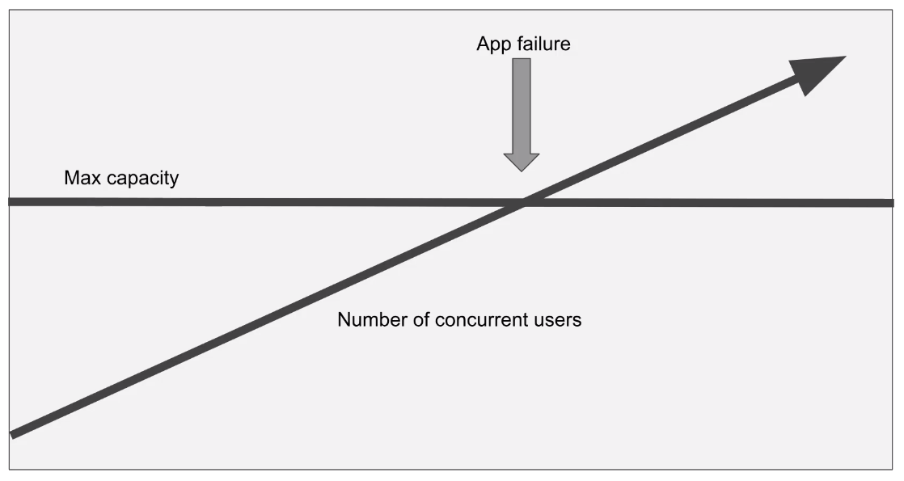
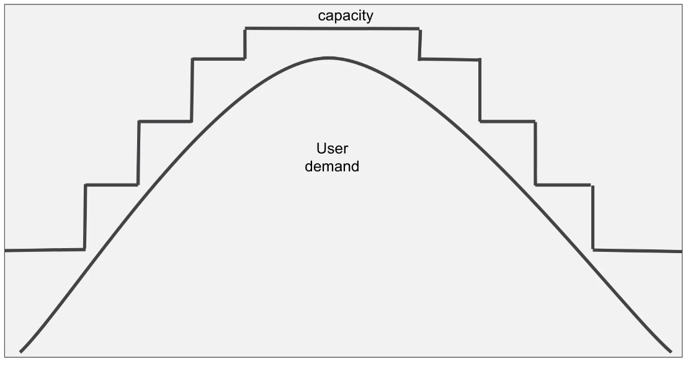
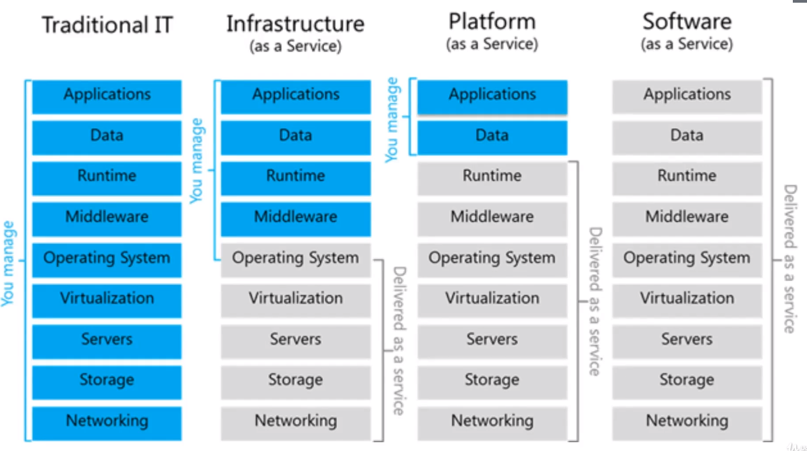
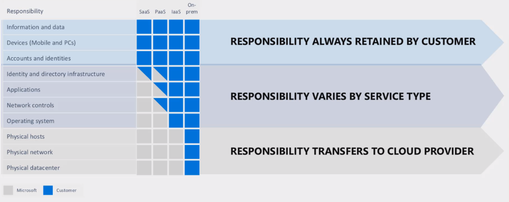

# Cloud concepts

- Management of hardware and software by a third party
- The computer is in a data center instead of at your company
- Flexibility to add or remove resources (ram, computing, etc)
- Pay for what you use!
- `Lift and shift`: move to cloud
- Benefits:
  - `Economy`: Pay as you uso. Cost prediction
  - `Agility`: Quick to deploy
  - `Availability`: Always up
  - `Scalability`: Vertical (add more cpu). Horizontal (Add more servers)
  - `Elasticity`: Grow or shrink based on demand
  - `Actual`: Infraestruture always updated
  - `Reliability`: Availability, redundancy, fault tolerance
  - `Global`: Servers around the world and low latency
  - `Security`: Physical and digital

## Concepts

- **High availability**

  - The ability of a system to respond to users (in percentage)
  - `99,99%`: 4 minutes a month of down time

- **Scalability**

  - Ability of a system to handle growth of users or work

  

- **Elasticity**

  - Ability of automatically grow and shrink based on application demand

  

- **Agility**

  - Ability to change rapidly based on changes to market or environment

- **Fault tolerance**

  - Ability of a system to handle faults like power, networking or hardware failures

- **Disaster Recovery**

  - Ability of a system to recover from failure `within a period of time`, and `how much data is lost`

- **Economy of scale**

  - It's cheaper for a Cloud Provider to run a server than you can ever achieve yourself

- **CapEx and OpEx**

  - `Capital Expenditure` (CapEx): Money invested in assets (E.g., a computer) that return investment over time
  - `Operational Expenditure` (OpEx): Money spent every day on operating expenses

- **Consumption-Based Model**

  - Pay per minute
  - Pay per hour
  - Pay per execution

## Paradigms for hosting applications (IaaS, PaaS, SaaS)

- **IaaS** (Infrastructure as a Service)

  - Virtual machine, networking, load balancer, firewall
  - Maximum control over the hardware

- **PaaS** (Platform as a Service)

  - No direct access to the hardware. "Upload the code and the platform will execute and provide it"
  - You have to choose an App Service Plan
  - Scaling is your responsability

- **Serverless**

  - Even less access to the server than PaaS
  - Serverless means not worrying about choosing the right plan
  - You pay nothing is you don't use the service
  - `Functions`, `Serverless Kubernetes`, `SQL DB serverless`, `Cosmos DB serverless`

- **SaaS** (Software as a Service)

  - The application is already there. You don't have to deal with code
  - Access to configuration only
  - Subscription model
  - Microsoft 365, Skype, etc

- **On-premise**

  - You buy a machine and manager it yourself

- The `Shared Responsability Model` tells up to until what task the cloud provider or the customer is responsible for

## Cloud implementation models

- **Public cloud**

  - Computing services offered over public internet
  - There might be unattended security requisites in the model

- **Private cloud**

  - Computing services offered to only selected users; internal or corporate cloud
  - Cloud environment in your own datacenter (E.g., Openstack)
  - There will be CapEx to buy the necessary hardware and OpEx for its maintenance

- **Hybrid cloud**

  - Combination of public and private cloud
  - Usually the private cloud is used, but when it needs to scale (in a peak), it goes to the public cloud
  - E.g., Host a website in public cloud and database in private cloud
