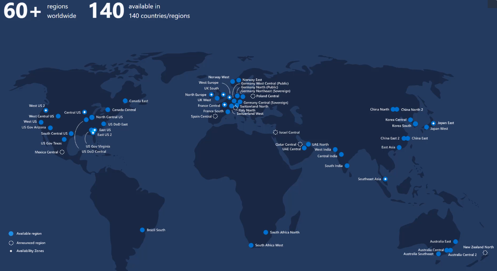
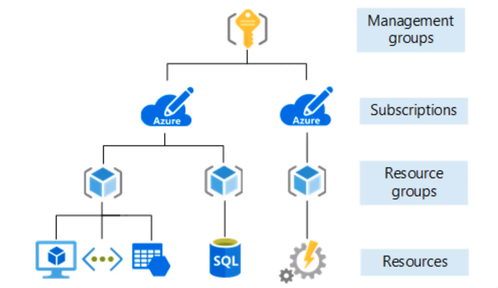
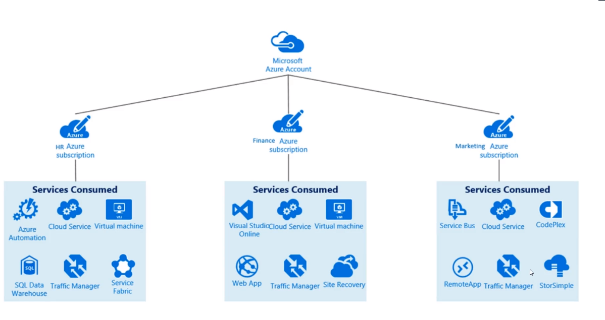
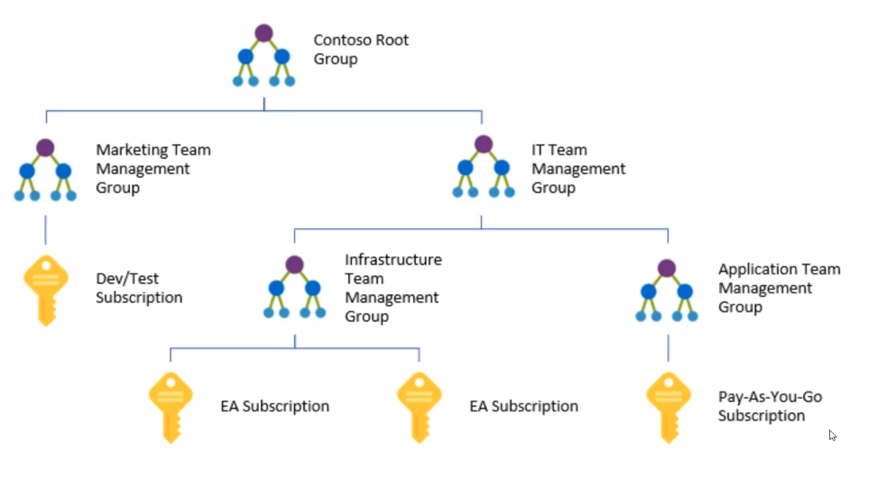
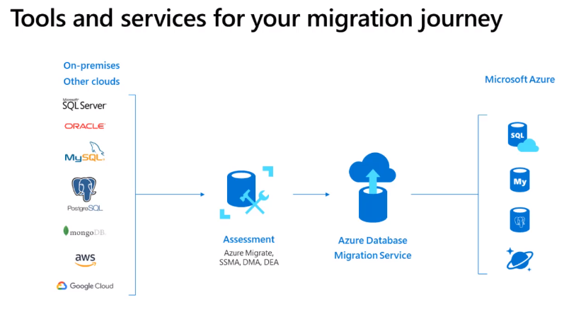

# Azure services

## Azure concepts

- **Geography**

  - Americas, Europe, Asia Pacific, Middle East and Africa

- **Zones**

  - `Zone 1`: US, EU, Canada, UK, France
  - `Zone 2`: Asia Pacific, Japan, Australia, India, Korea
  - `Zone 3`: Brazil South
  - `Zone 4`: Germany Central, Germany Northeast

- **Regions**

  - `Area of the planet` that contains at least one datacenter
  - Each regions belongs to a only one geography
  - Brings the app cloud of the user (low latency)
  - Data compliance
  - Not all regions are available to everyone (E.g., government regions)
  - Currently `60+ regions`

  

- **Regions Pairs**

  - Regions pairs are almost always in the same geography
  - Data connection between region pairs is the highest available
  - Software rollout to one pair and the other is left untouched (in case of failure)
  - For `multiple deployments` makes sense to deploy one to each pair
  - Example pairs: `Canada Central - Canada East`, `North Europe - West Europe` `East US - West US`, `Brazil South - South Central US`

- **Availability Zones**

  - A availability zone is a `datacenter` in a region. A region contain one or multiple availability zones
  - It's a datacenter equipped with independent energy, cooling, networking, etc
  - A certain availability zone cant be picked

- **Resource groups**

  - A way of organizing groups
  - Group resource in a folder structure

  

- **Resources**

  - A resource is a instance of a service that is yours to use

- **Subscription**

  - Subscription is a `billing unit`
  - Users have access to one or more subscriptions
  - Organize resources into distinct accounts

  

- **Management group**

  - A way to organize the subscriptions

  

- **Resource manager** (ARM)

  - A common API to interact with the Azure services
  - No matter what way to interact with azure you are using (sdk, cli, portal), it will be "converted" to ARM
  - ARM templates

## Core Azure Products

### Compute

- `Virtual machines`: IaaS. Optionally Multiple VMs running behind a load balancer (scale set)
- `App services`: PaaS. Give your code and configuration and Azure will run it
- `Serverless`: Azure functions or Logic Apps. Small bits of code that run natively in the cloud. Insert the code in the portal editor
- `Containers`: Azure Container Instance (ACI). Azure Kubernetes Service (AKS)
- `Windows Virtual Desktop`: Version of windows that runs in the cloud

### Networking

- **Connectivity**
  - `Virtual Network`: emulate a physical network
  - `Virtual Private Network` (VPN): connect two networks as if they were on the same network
  - `ExpressRoute`: high-speed private connection to Azure
- **Protection**
  - `DDoS` Protection: Distributed Denial of Service
  - Azure Firewall
  - Network Security Groups (`NSG`): Access control list (ACL). Static rules
  - Private Link
- **Delivery`**
  - `Load Balacer`: Distribute traffic evenly between multiple backend servers
  - `Application Gateway`: higher-level load balancer with firewall options
  - `Content Delivery Network` (CDN): stores common static files on the edge
  - `Azure Front Door Service`: LB, CDN and Firewall all-in-one
- **Monitoring`**
  - `Network watcher`: track traffic and see where it's stuck
  - ExpressRoute Monitor
  - Azure Monitor

### Storage

- `Unmanaged storage`

  - General purpose v2 (gpv2): _blobs_, _tables_, _queues_, _files_
  - Azure data lake storage gen2: cheapest type of storage. Pay per GB (1.8 cent per GB)
  - Options: _Access tiers_, _performance tiers_, _location_, _redundancy/replication_, _failover options_

- `Managed storage`

  - Virtual Machine Disks

- `Backup, replication and recovery storage`

  - Recovery Services Vault
  - Azure Site Recovery

### Database

- `Document Oriented DBs`

  - CosmosDB

- `Relational DBs`

  - AzureSQL
  - Azure MySQL
  - Azure PostgreSQL
  - SQL Managed Instance: Fully managed by Azure

- `Database Migration Service`

  - Tools and services for your migration of data to the cloud

  

- `Synapse Analytics` (SQL DW)

  - Big data
  - Does pre-processing on the data to make queries faster
  - Analytical database, not transactional
