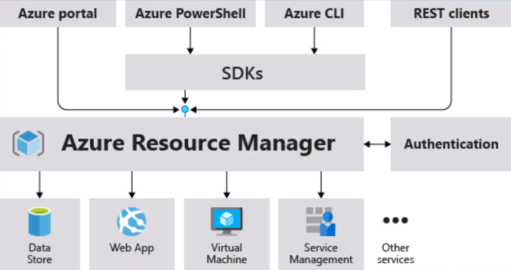
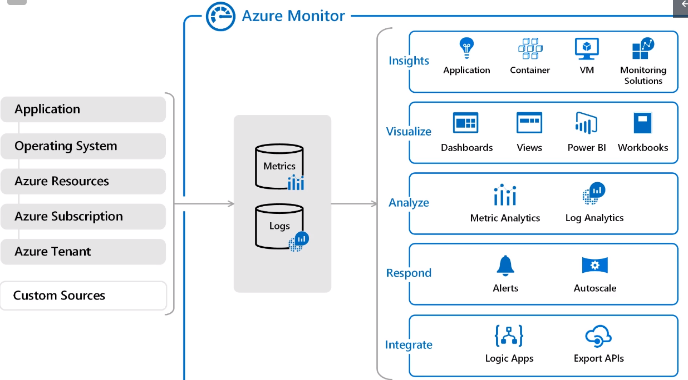

# Azure Core Solutions

## Core Azure Solutions

- `Internet of Things` (IoT)

  - IoT Hub
  - IoT Central
  - _Azure Sphere_: platform designed to work with connected devices. A chip with SphereOS

- `Big data and Analytics`

  - Synapse Analytics
  - HDInsight: Apache Hadoop services
  - Azure Databricks: Pull data and manipulation of external data and generation of reports

- `Artificial intelligence` (AI)

  - Machine Learning Service
  - Cognitive Services
  - Azure Bot Service (natural language chatbot)
  - Studio

- `Serverless`

  - Azure Functions
  - Logic Apps
  - Event grid

- `DevOps`

  - Github & Github Actions
  - DevTest Labs: flexible VMs, shut down any time

## Management Tools

- `Azure CLI`: Bash
- `PowerShell`: Powershell
- `Portal`: GUI
- `Cloud Shell`: Command line (CLI or powershell) from browser
- `Mobile App`: Monitor health and status of resources. Start/Stop servers
- `ARM templates`: Management layer that allows you to create, update and delete resources. All operations regardless of the medium is performed through the ARM layer

- `Advisor`

  - Similar to security center
  - Makes recommendations about cost, security, reliability, operational excellence, performance

- `Monitor`

  - Collects all the data for you to analyze and create alerts on
  - Save as `log` files or use as `metrics`

  

- `Service Health`

  - Show health issues with Azure services
  - Show info about all general azure services, which may not apply to you
