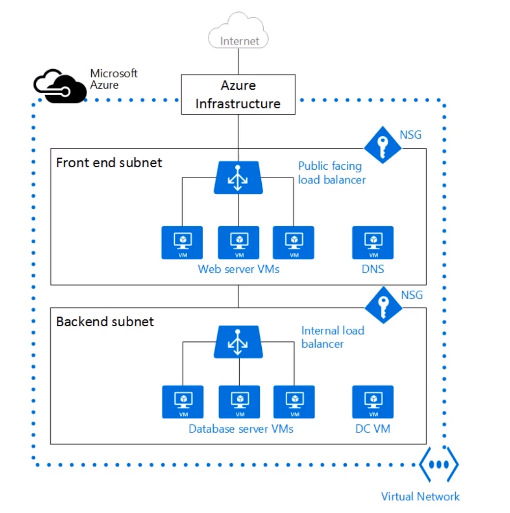
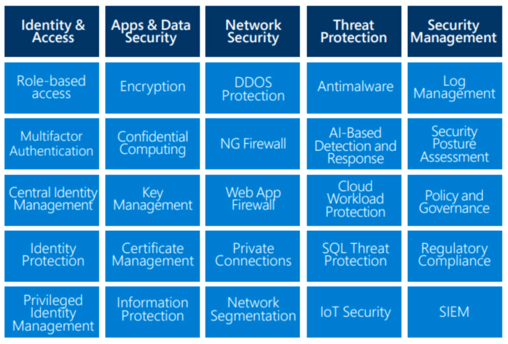

# General and Network Security Features

## Security features

- `Security Center`: Dashboard that analyses apps and network and makes recommendations. Free and paid tiers
- `Key vault`: Central, secure repository for your secrets, certificates and keys
- `Sentinel`: Centralizes log files from various resources. Analyze and detect threats
- `Dedicated hosts`: Hardware that is dedicated to you and ONLY you. Multiple VMs can be deployed into that hardware
- `Information Protection` (AIP): Apply labels to emails and documents
- `Advanced Threat Protection` (ATP)
  - Monitor profile user behavior and activities
  - E.g., on the weekend, outside of the office someone is trying to access
  - Identify suspicious activities and advanced attacks

## Network Security

- `Firewall`

  - Protect from Cross site Scripting (XSS) attacks
  - DDoS and API Management are not part of firewall

- `Network security group` (NSG)

  - Inbound NSG rules protect a destination IP address and port
  - Rules can be specified also by role (RBAC)
  - All virtual network subnets should use NSG

  

- `User defined route`

  - Force traffic through a firewall, or over a corporate network

- **Security layers - Defense in depth**

1. `Data`
   - Data in VM, database, SaaS app, etc
1. `Application`
   - Security by design (of the application)
   - API management
1. `Compute`
   - Updated VMs (Windows updates), endpoint protection
1. `Network`
   - NSG
   - Use of subnets
   - Deny by default
1. `Perimeter`
   - DDoS
   - Firewalls
1. `Identity & access`
   - Azure AD
   - SSO & MFA
1. `Physical`
   - Door locks
   - Key cards

