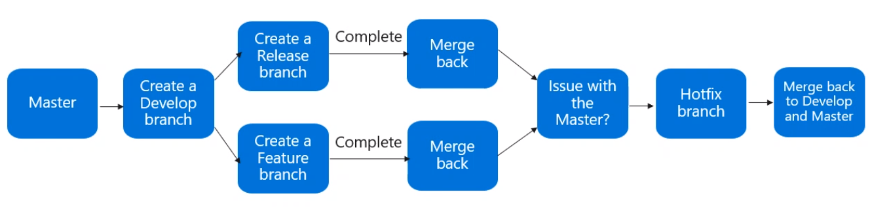

# Source Control Management (SCM)

- Tracking and managing changes to code
- `Source Control Management` (SCM) provides a history of the code development
- Resolve conflicts when merging different codes

## Centralized Version Control

- Single central copy of the project and programmers commit their changes to this central copy
- Easily scales for large codebases
- Examples: `Team Foundation Version Control (TFVC)`, `CVS`, `Subversion (SVN)`, `Perforce`

## Distributed Version Control

- Every developer clones a copy of a repository and has the full history of the project
- Does not depend on a central repo
- `Git LFS` is used to store the large files
- Examples: `Mercurial`, `Git` and `Bazaar`

## Azure Repos

- Set of version control tools to manage your code
- Git or TFVC

## Mono vs Multi Repos

- `Mono-repo`: Clear ownership, better scale, narrow clones
- `Multi-repo`: Better testing, reduce code complexity, easy refactoring, sharing common components, effective code reviews

## Branching workflow

- `Feature branch`

  - All feature development should take place in a dedicated branch (never in master)

  1. Create a branch
  1. Add commits
  1. Open PR
  1. Discuss and review your code
  1. Deploy
  1. Merge

- `Git flow`

  - Release-based software workflow
  - Dedicated channel for hotfixes to production

  1. Master
  1. Create develop branch (based on master)
  1. Create release branch (based on develop) - Associate with a tag
  1. Merge back (to develop)
  1. Issue with the master?
  1. Create hotfix branch (based on master)
  1. Merge back to develop and master

  

- `Git fork`

  - Forking branch gives every developer their own server-side repository
  - Merge between projects
  - Used commonly for open-source projects

## Git Hooks

- Allows code to be run before or after a certain git lifecycle event
- Use GitHooks to `enforce policies`
