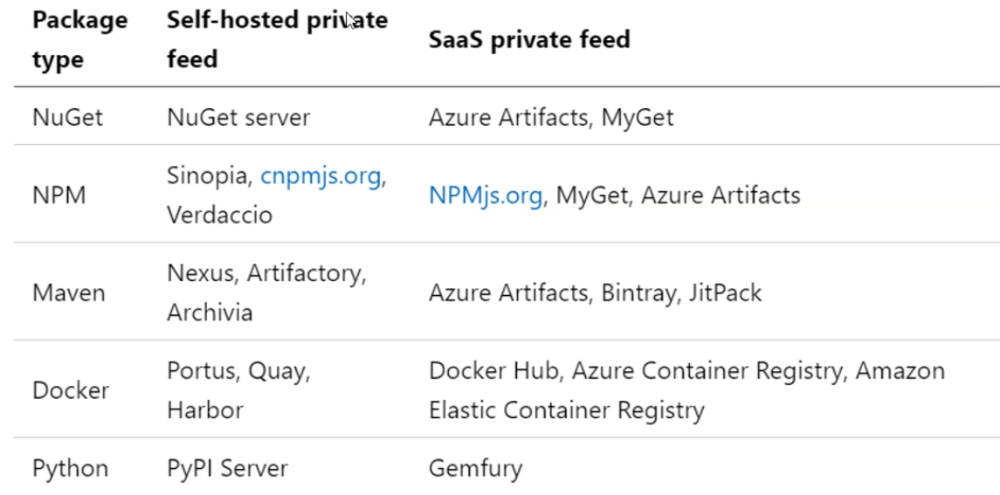

# Dependency Management

- Component based development is common
- `Azure Artifacts` is the Azure solution for artifacts
- Not all software is written by a single team
- `Componentization` can be done via `source code` or as a `package`

- **Elements of DM strategy**
  - `Standardization`
  - `Package formats and sources`
  - `Versioning`

## Packages

- Mechanism to create, share and consume code and components
- Contains compiled code with metadata content for consuming it

### Packages feeds

- Centralized storage of package artifacts
- Also known as `package repositories` or `package registry`
- `Public feeds`
  - nuget.org
  - npmjs.org
  - pypi.org
  - dockerhub
- `Private feeds`
  - MyGet
  - Azure Container Registry
  - Azure Artifacts
  - Self-hosted solution
- `Package (feed) managers`: A way to search, push, pull, etc
  - nuget: .NET artifacts
  - npm: Node.js modules
  - python: python scripts
  - maven: java
  - docker: container images

