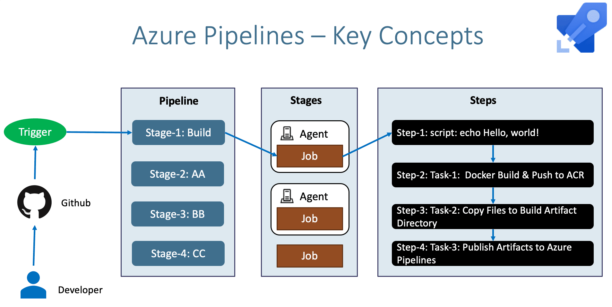

# Pipelines

- Enable constance flow of changes into production
- Verify if the software is working ok
- `Azure Pipelines` automatically build and test your code project
- Works great with `Continuous Integration` and `Continuous Delivery`
- `Agent`: The machine that runs the pipelines
  - `Microsoft-hosted agents`: MS takes care of the maintenance and upgrades
  - `Self-hosted agents`: My own VM with my utilities to run the build environment
  - Policies can be created for the utilization of certain agents
- `Parallel jobs`: Can run multiple builds. Azure paid feature

## Pipeline Stages

- `Stage` has jobs
- `Job` has steps
- `Step` is a script or a task

## Service Connections

- <https://dev.azure.com/hvitoi/my-project/_settings/adminservices>
- Service connections are credentials that allow external access. E.g., aks, github, docker registry
