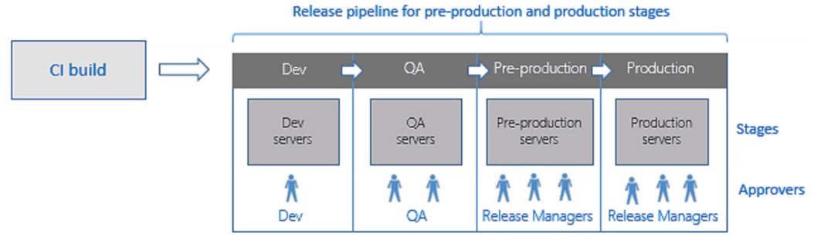
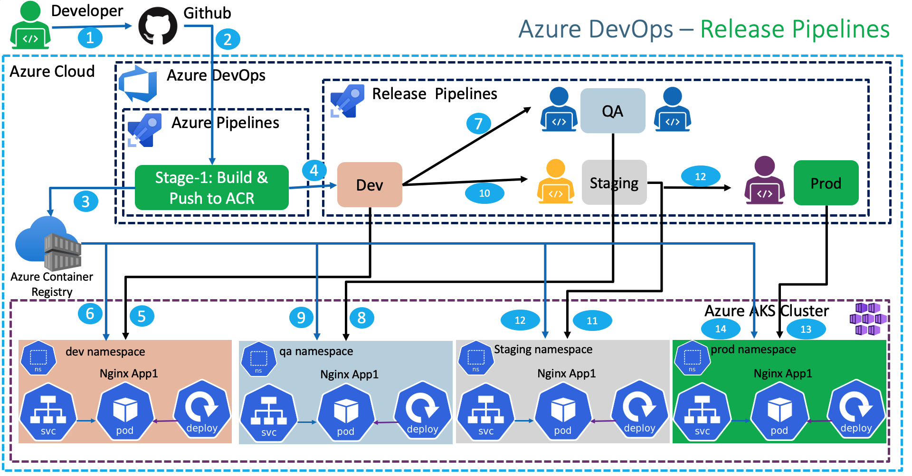
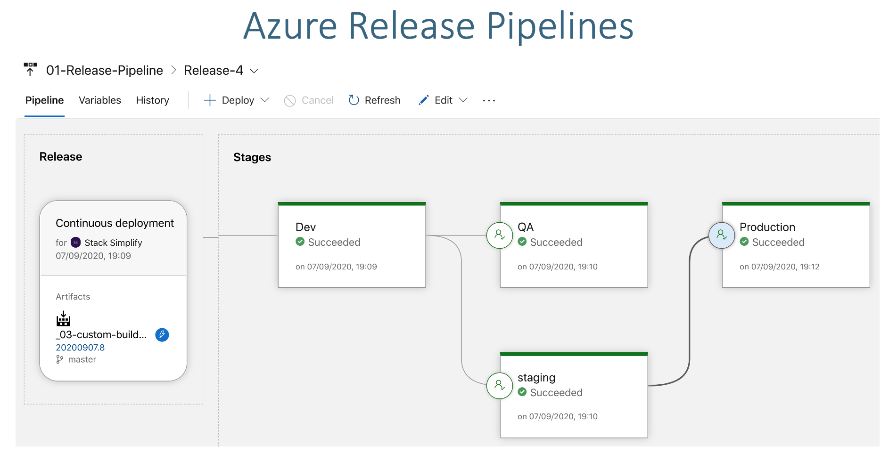

# Release Pipelines

- `Release Pipelines` are used to achieve `Continuous Delivery`
- Deploy the same version of the build across different environments
- The deployment in each environment requires an approval

## Elements

- `Artifact`: document that describes the deployment (e.g., kube manifests)

  - From a previous Build Pipeline (the build pipeline must publish it)
  - From a git repository
  - From TFVC

## Pre-deployment conditions

- `Trigger`

  - `After Release`: Automatically as soon as the build pipeline finishes (continuous deployment trigger)
  - `After Stage`: After another release has been completed
  - `Time Scheduled`
  - `Manual only`

- `Approvals`

  - Email someone to approve the deployment

## Post-deploment conditions

- `Approvals`
  - Users who can approve or deny any stages after this one
- `Gates`
  - Quality gates
