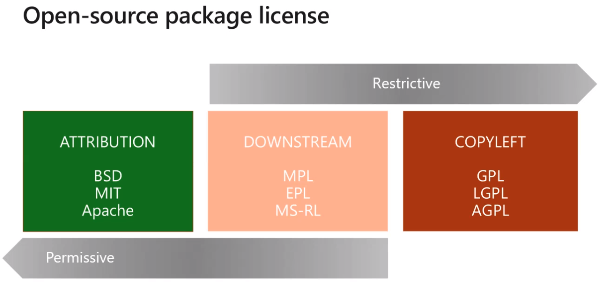

# Package versioning, security and compliance

- `Package feeds` are trusted sources of packages

  - Feeds have to be `secured`!
  - Not allow access by unauthorized users

- Companies must be compliant to rules and regulations

  - Governmental
  - Certification
  - Standards

- `Roles`
  - Reader
  - Collaborator
  - Contributor
  - Owner

## Open SOurce projects

- Opensource software have licenses might break compliance rules!
- Opensource package licenses

## Tools

- Artifactory
- SonarQube
- WhiteSource

## Package versioning

- Package are immutable
- Any change requires a new version
- `Typical schema`: 2.1.15
  - Major: 2
  - Minor: 1
  - Patch: 15
- `Semantic versioning`: 1.2.3-beta2
  - 1.2.3: nature of change
  - beta2: quality of change
- `Release views`
  - 3 default views: local, release, prerelease
