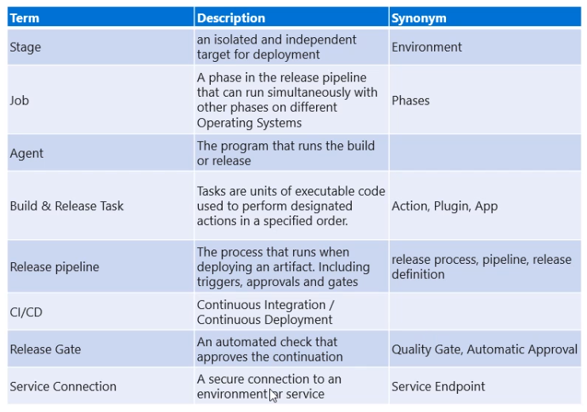
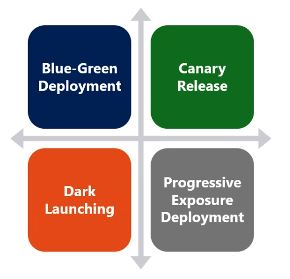

# CI/CD

## Continuos Integration (CI)

- Process of automating the build and testing of code
- CI keeps the master branch clean ensuring bugs are caught before the merge
- 4 pillars
  - `Version Control System`
  - `Package Management System`
  - `Continuous Ingration System`
  - `Automated Build Process`

## Continuos Delivery (CD)

- **Principles**
  1. The process for release/deploying software must be repeatable and reliable
  1. Automate everything
  1. If somethind difficult or painful, do it more often
  1. Keep everything in source control
  1. Done means released
  1. Build quality in
  1. Everybody has responsibility for the release process
  1. Improve continuosly

## Releases and Deployments

- Release and deployment
- Separate that in fuynctional and technical release
  - `Functional release` is exposing features to customers

## Feature toggles

- Toggle feature without needing to redeploy

## Artifact sources

- Build artifacts
- Package repositories
- Container repositories
- Files
- Source Control

## Delivery cadence

- 3 types of triggers
  - Continuous deployment trigger
  - Scheduled trigger
  - Manual trigger

## Modern Deployment Patterns

1. `Blue-Green`: Prod + prodlike
1. `Canary`: Few users accept to use the new feature
1. `Dark`: Transparent new functionalities for the users (user do not choose)
1. `Progressive Exposure`: Gradually expose the feature to new users

## Release management tools

- Jenkins
- CircleCI (not recommended)
- Azure DevOps Pipelines
- Gitlab Pipelines
- Atlassian Bamboo
- XL Deploy/XL Release

## Test infrastructure

- `Availability tests`: URL ping test, health endpoints
- **Automate inspect of health**
  - Release gates
  - Events, subscriptions and notifications
  - Service hooks: trigger tasks when events happen
