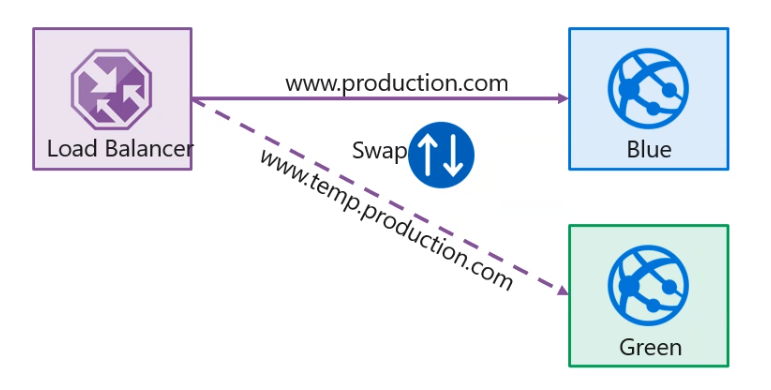

# Feature flag

- CI is more than release management
- Deployment is only a step
  - Testing
  - Safe Coding
  - Architecture
- Monoliths are hard to deliver because of all the dependencies
  - Break up in smaller pieces (Microservices)
- Development patterns
  - dev -> test -> staging -> production

## Modern deployment solutions

- **Blue-Green Deployments**

- **Canary Releases**

  - Release a feature to a limited subset of end users
  - Validate ther eis no break
  - When you want to gradually roll out a feature to ensure enough capacity

- **Dark Launching**

  - Similar to Canary
  - But the user doesn't know he's using a new feature

- **A/B testing**

  - Compare two features and see which one provides a better performance

- **Progressive Exposure Deployment**
  - Windows insiders

## Feature toggle/flag

- Separate `feature deployment` from `feature exposure`
- aka feature flippers, feature flags, feature switch, conditional feature
- Enables A/B testing, canary releases, dark launching
- Alternative to keeping multiple branches in version control
- Enable changes without redeployment

## Traffic manager options

1. Availability
1. Robin
1. Weight
1. Latency
