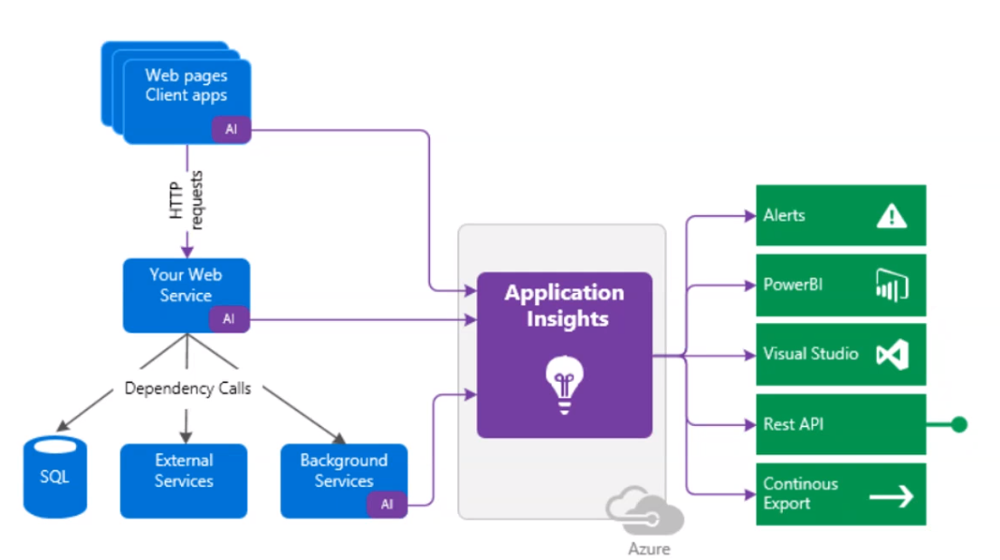
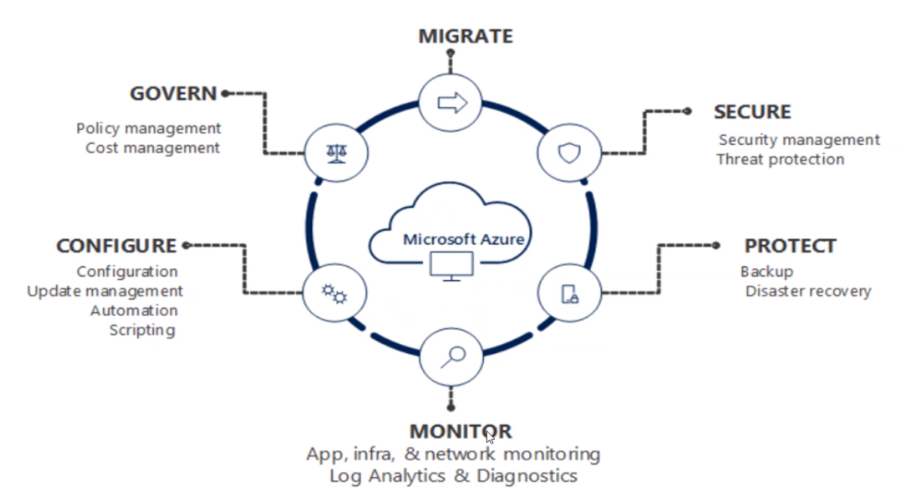

# Monitoring

## Application Insights

- Collect logs

## Bug tracker

- Take events before it crashes

## Azure Dashboard

- Main dashboard to centralize all info

## Azure Monitor

- Workbooks: Create guides for problem solutions

## PowerBI

- Business Intelligence

## Grafana

- Collector of data from prometheus
