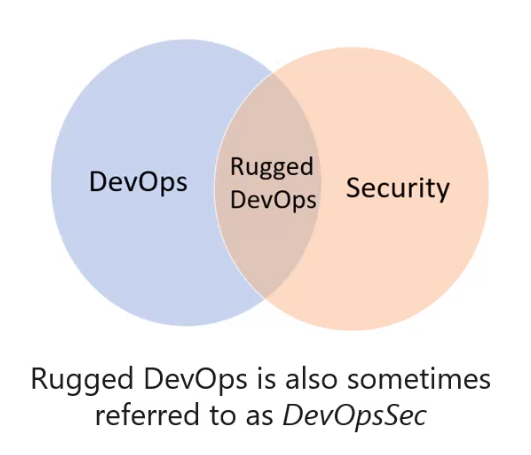
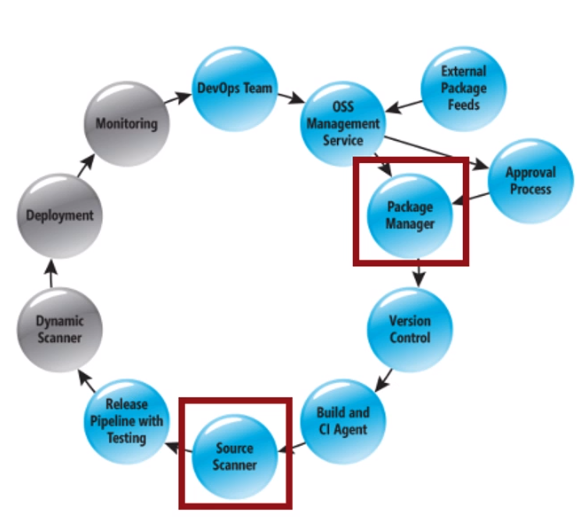

# DevSecOps

- Rugged DevOps

## Tools

- White Source
- Micro Focus Fortify
- Checkmarx integration
- Veracode

## Ops and pipeline security

- Authentication and Authorization
- use the CI/CD release pipeline
- Manage Permission
- Dynamic Scanning
- Monitoring Production

## Azure Security Center

- Security recommendations
- Monitor security settings
- Monitor all your services
- Use Azure ML
- Analyze and identify potential attacks
