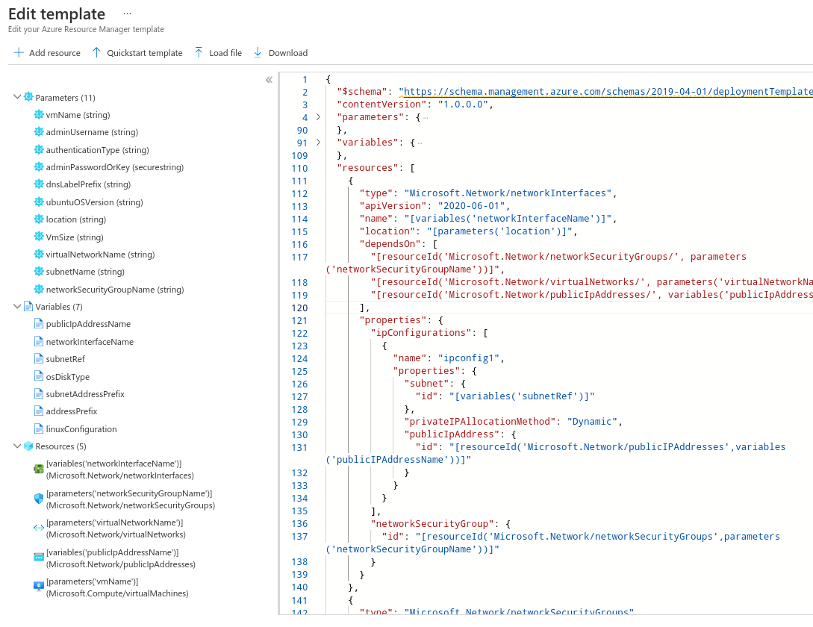

# Template deployment

- Automate deploying resources with `Azure Resource Manager` templates

## Elements

- `$schema`: Schema specification
- `contentVersion`: Schema version
- `parameters`: Provide values during deployment phase (runtime)
- `resources`: Specify the resources to be deployed
- `variables`: Values that can be reused in the template.
- `outputs`: Return value from the deployed resources
- To create a new template resource: `template deployment (deploy using custom templates)`

```json
{
  "$schema": "http://schema.management.azure.com/schemas/2015-01-01/deploymentTemplate.json#",
  "contentVersion": "1.0.0.0",
  "parameters": {},
  "resources": []
}
```



## Variables

```json
{
  "variables": {
    "hahaPrefix": "10.0.0.0/16",
    "hahaSubnet1Name": "Subnet-1",
    "hahaSubnet1Prefix": "10.0.0.0/24",
    "hahaSubnet2Name": "Subnet-2",
    "hahaSubnet2Prefix": "10.0.1.0/24"
  }
}
```

- Accessing variables defined in variables section
  - `"[variables('variable-name')]"`
- Acessing variables defined in screen section
  - `"[resourceGroup().location]"`

## Parameters

- Parameters can be modified when creating the resources at the deployment screen

```json
{
  "parameters": {
    "networkname": {
      "type": "string",
      "defaultValue": "armnetwork",
      "metadata": {
        "description": "Name of the VNet"
      }
    },
    "networkaddress": {
      "type": "string",
      "defaultValue": "10.6.0.0/16",
      "metadata": {
        "description": "Address of the VNet"
      }
    },
    "subnetname": {
      "type": "string",
      "defaultValue": "default",
      "metadata": {
        "description": "Name of subnet"
      }
    },
    "subnetaddress": {
      "type": "string",
      "defaultValue": "10.6.0.0/24",
      "metadata": {
        "description": "Address of subnet"
      }
    }
  }
}
```

- Accessing parameters
  - `"[parameters('parameter-name')]"`

## Resource iteration

- Create 3 storage accounts, one after the other
- `concat()`: concatenate strings
- `copyIndex()`: returns index of that resource (1, 2, 3)
- `uniqueString()`: returns a unique string

```json
{
  "$schema": "https://schema.management.azure.com/schemas/2015-01-01/deploymentTemplate.json#",
  "contentVersion": "1.0.0.0",
  "parameters": {},
  "resources": [
    {
      "name": "[concat(copyIndex(),'storage',uniqueString(resourceGroup().id))]",
      "type": "Microsoft.Storage/storageAccounts",
      "location": "[resourceGroup().location]",
      "apiVersion": "2019-06-01",
      "kind": "StorageV2",
      "sku": {
        "name": "Standard_LRS"
      },
      "dependsOn": [],
      "tags": {},
      "properties": {},
      "copy": {
        "name": "storagecopy",
        "count": 3,
        "mode": "Serial",
        "batchSize": 1
      }
    }
  ]
}
```
