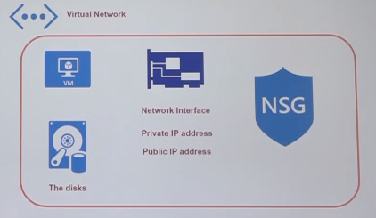

# Virtual Machines

- A `VM` is attached to a `Network Interface`, which has a private and public `IP address`
- A `VM` is attached to a `storage account`, which stores the OS disk
- A `Network Security Group` (Firewall) is assigned to the network interface
- All these items are wrapped by a `Virtual Network`

- Vm resources

  1. Virtual Network
  1. Virtual Machine
  1. Disk
  1. Network interface
  1. Public IP address
  1. Network Security Group



- **Restart / Stop VM**

  - `On restart`: Temporary disk remains, public IP remains
  - `On stop/deallocate`: public IP is lost, temporary disk is erased (Stop only by the azure portal)

- Access the VM (Windows) via RDP with the public IP + port 3389
- Access the VM (Linux) via SSH with the public IP + port 22

## VM size

- `D2 v2`: 2 vCPU, 7gb, 100gb temp. _R$691,67_
- `D2 v3`: 2 vCPU, 8gb, 16gb temp. _R$623,69_

- If the machine is resize, the VM is restarted

## Backup

- `Azure Backup` to backup and restore a VM

## Networking

- `Accelerated Networking` to improve the performance of the VM

## Windows VM

- Windows Server 2019 Datacenter
  - `Gen 1`: BIOS boot
  - `Gen 2`: UEFI boot, Disk > 2TB allowed
- **Additional features**
  - `Web server`: Internet Information Services (IIS). Port 80 must be added to inbound port rules. IIS can be installed in the **Server Manager**

## Linux VM

- Ubuntu 18.04
- **Additional features**
  - `Web server`: NGINX. Port 80 must be added to inbound port rules

## Generalizing a VM

- Create an image out of a running VM
- For a Windows VM, the `sysprep` program must be run inside the VM
- In the VM portal, use `Capture` button to generate the image
- The new image will be a shown are an `image resource`
- The generalized image of the VM is saved in a `Blob Storage`

## Boot diagnostic

- Look what happens at the boot time of a VM
- Boot diagnostics can be enabled with `managed storage` or `unmanaged storage`

## Serial Console

- Opens a console onto the VM
- REquires `unmanaged storage account` to be set on boot diagnostics

## Run command

- Allows to run a script inside the VM
- Useful for troubleshooting and recovery
  - E.g., run a `pwsh` script, disable windows updates, List Ip config

## Redeploy

- Redeploy a VM to another physical host

## Custom scripts

- Custom scripts can be made to install additional features in a Windows or Linux VM
- `.ps1` extension for Windows,`.sh` for Linux
- Custom scripts must be stored in a storage account (Same location as the VM), or can be taken from internet (E.g., github)

- **Add extensions in VM**

  - IN the VM, the `custom script` extension must be added `via portal` or `via cli`
  - Then the script file is requested

  ```sh
  az vm extension set \
    --resource-group "test-rg" \
    --vm-name "demovm" \
    --name "customScript" \
    --publisher "Microsoft.Azure.Extensions" \
    --settings "customscript.json"
  ```

### Windows

```ps1
import-module servermanager
Add-WindowsFeature web-server -includeallsubfeature # install IIS
Set-Content -Path "C:\inetpub\wwwroot\Default.html" - Value "This is the server $($env:computername)!" # Create index file
```

```json
{
  "fileUris": [
    "https://raw.githubusercontent.com/alashro/sampleweb/master/InstallIIS.ps1"
  ],
  "commandToExecute": "powershell.exe ./InstallIIS.ps1"
}
```

### Linux

```sh
# Example script (must be wrapped in a json if taken from internet)
apt-get update -y
apt-get install -y nginx
```

```json
{
  "fileUris": [
    "https://raw.githubusercontent.com/alashro/sampleweb/master/install_web.sh"
  ],
  "commandToExecute": "./install_web.sh"
}
```

### Cloud init

- Cloud init is used to customize a Linux VM as it boots for the first time
- You can use cloud-init to install packages and write files or to configure users and security
- Cloud init is setup in `advanced tab` in VM creation

```yaml
#cloud-config
package_upgrade: true
packages:
  - nginx
```

## Deploying a project to Virtual Machine

1. **Run a VM**

   - Run a VM

1. **Configure VM (Windows)**

   - In `Server Manager` (Windows Server 2019), add features:

     - Web Server (IIS) / Management Tools / Management Service

   - In `IIS Manager`

     - Select the `VM`, select `Management Service`
     - Enable remote connections on port 8172 and apply

   - In `Server Manager`/ `Local Server`

     - Set `IE enhanced security configuration` to off

   - Install `Dotnet Core 3.1` in the VM

     - <https://dotnet.microsoft.com/download/dotnet/3.1>

   - Install `Web deploy 3.6` in the VM

     - <https://www.microsoft.com/en-us/download/details.aspx?id=43717>

1. **Configure VM (Linux)**

   ```sh
   # Install .NET Core 5.0
   wget https://packages.microsoft.com/config/ubuntu/18.04/packages-microsoft-prod.deb -O packages-microsoft-prod.deb
   sudo dpkg -i packages-microsoft-prod.deb
   sudo apt-get update
   sudo apt-get install -y dotnet-sdk-5.0

   # Install Web Server
   sudo apt-get install -y nginx
   sudo vim /etc/nginx/sites-available/default # change nginx configuration
   sudo systemctl restart nginx
   ```

   - Nginx config section

   ```conf
   location / {
      proxy_pass http://localhost:5000;
      proxy_http_version 1.1;
      proxy_set_header Upgrade $http_upgrade;
      proxy_set_header Connection keep-alive;
      proxy_set_header Host $host;
      proxy_cache_bypass $http_upgrade;
   }
   ```

1. **Configure DNS**

- `Configure the DNS` name for the public IP resource
- Set a static public IP
- Set a DNS name for the VM

1. **Allow ports in NSG**

- Install IIS or NGINX in the VM
- Allow `port 80 TCP` inbound rule (web server)
- Allow `port 8172 TCP` inbound rule (publish app service) -- only for Windows

1. **Deploy app**

```sh
dotnet new console -n "sample-project"
```

1. **Publish the app**

   - Using CLI or Visual Studio
