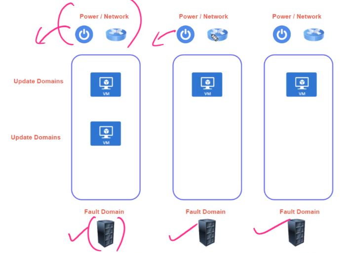
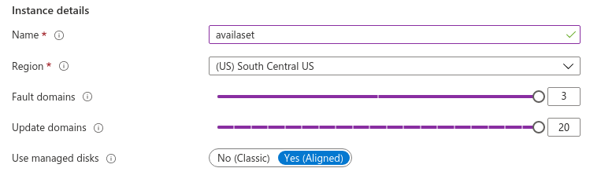

# Availability sets

- An availability set can be thought of as a `rack`
- A `fault domain` is a physical server, if all machines are in a single fault domain, they can fail together. Different fault domains have independent power and network sources
- An `availability set` is a group of different fault domain. Each new VM is deployed to a different fault domain
- `Update domains` are different racks in an `fault domain`, they are restarted one at a time. It's good to have VMs distributed across update domains too
- If two or more instances are deployed in same availability set, you get `99.95% SLA`

- It's recommended to use managed disks for Availability sets
- The newly created VMs must be then assigned to a Availability Set
  - Assigning a VM to an Availability Set can only be done upon creation
  - When an Availability Set it deleted all its VMs are deleted as well
