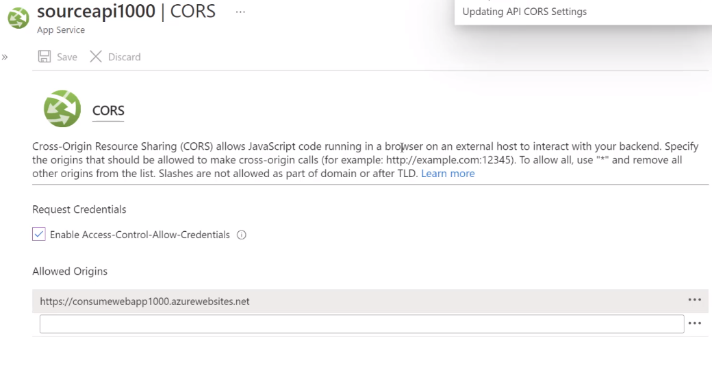

# Web App

- Web Apps is a easier way to deploy apps. It's a `PaaS` solution, a VM managed by Azure
- Instead of deploying it directly to a VM (`IaaS`), web apps are more convenient

```sh
# Create App Service Plan
az appservice plan create \
  --resource-group "demo-rg" \
  --name "hvitoi-appserviceplan" \
  --sku "B1"

# Create Web App
az webapp create \
  --resource-group "demo-rg" \
  --name "hvitoi" \
  --plan "hvitoi-appserviceplan"
```

- <https://hvitoi.azurewebsites.net>

## Logs

- Types of logs
  1. Application Loggin
  1. Web server logging
  1. Detailed error messages
  1. Deployment logging
- The different types of logs be stored to the filesystem or to a container in a `storage account`
  - Access under `App Service Logs`
  - The `Retention period` can also be established
- `Log stream` displays the logs in the console

## Application Settings

- You can set your `environment variables` with the `application settings` in the `Settings` of the webapp
- E.g., CONNECTION_STRING=mongodb://supersecret@username:key?10020
- The application settings are `injected into the application` on the fly! (No redeploy needed)
- Requires the `app.UseAzureAppConfiguration()` middleware
- With application settings you can implement `feature flags`

## Deployment

- **Via azure extension**

  1. **Install VS code extension**: `Azure App Service` for vscode
  1. **Create web app**: create project
  1. **Configure web app**: For node apps, azure just runs the start script in package.json
  1. **Deploy using the Azure tab**: Add web app and deploy the project folder. Azure creates a file with necessary config

  - For .NET 5.0 applications, the root project folder can be deployed. The extension will build and deploy the publish folder
  - For Node.JS application, the start script will be used to run the app

- **via local git repository**

  - `Deployment scripts` can be generated to automate the deployment process
  - A credential must be generated for the `app service`
  - To generate the `deployment credentials` go to `Deployment Center` -> `FTPS credentials`
  - Then define a user scoped username and password

  - Configure deploy from a local repository (instead of deploying from the app services extensions)

  ```sh
  SUBSCRIPTION="Azure for Students"
  RESOURCEGROUP="appsvc_linux_centralus_basic"
  LOCATION="centralus"
  PLANNAME="appsvc_linux_centralus_basic"
  PLANSKU="B1"
  SITENAME="app-withlove"
  RUNTIME="NODE|14-lts"

  # login to azure
  az login

  # list subscriptions
  az account list -o "table"

  # set default subscription
  az account set --subscription "$SUBSCRIPTION"

  # create resource group
  az group create --name "$RESOURCEGROUP" --location "$LOCATION"

  # create appservice plan (a machine) where your site will run
  az appservice plan create --name "$PLANNAME" --location "$LOCATION" --is-linux --sku "$PLANSKU" --resource-group "$RESOURCEGROUP"

  # create the web application on the plan
  az webapp create --name $SITENAME --plan $PLANNAME --runtime $RUNTIME --resource-group $RESOURCEGROUP
  ```

  ```sh
  # set up the credentials to deploy into the azure remote repository
  USERNAME="azure-deploy-username"
  PASSWORD="azure-deploy-password"
  az webapp deployment user set --user-name $USERNAME --password $PASSWORD

  # configure deployment from a local gitt repository
  az webapp deployment source config-local-git --name "$SITENAME" --resource-group "$RESOURCEGROUP"

  # set up new remote on the local git repository
  git remote add azure "https://$USERNAME@$SITENAME.scm.azurewebsites.net/$SITENAME.git"

  # push to azure remote repository to be deployed
  git push azure master

  # browse to the site
  az webapp browse --name $SITENAME --resource-group $RESOURCEGROUP
  ```

- **via github repository**

  - Go to the `Deployment Center` and configure the access to your github account

- **as a container**

  - Containerize the application as an `image` and tag it with the version you want
  - Push the image to your personal `container registry` (dockerhub or acr)
    - E.g., hvitoi.azurecr.io/my-webapp:latest, docker.io/hvitoi/webapp:latest
  - A resource **Web App** must be created in Azure Portal and `Docker Container` must be selected as publish method

## Continuous deployment

- In order to automatically pull and deploy the image or code `continuous deployment` must be turned on in the `Deployment Center`
- To update the webapp, click in `sync` in the deployment center
- For container applications the image is pulled from a container registry
  - A Webhook must be configured in the container registry to tell the azure web app that a new image has arrived! The `Webhook URL` appears under the `Deployment Center`

## Custom domain

- The default domain has the format <https://hvitoi.azurewebsites.net>
- Go to `custom domain` to change it
  - Select the record type (`A` (example.com) or `CNAME` (www.example.com))
  - To verify the ownership create a `CNAME` and `TXT` record in the DNS provider with the given configuration
- Custom domains are not supported for free or shared tier

### TLS/SSL

- Can be set up under `TLS/SSL settings` tab

- **Private Key certificates** (`.pfx`)
  - You can upload your certificates or create a managed certificate (by the app service)
  - After the private certificate is in place you can bind the certificate to the hostname
  - Now your page is HTTPS!
- **Public Key certificates** (`.cer`)

## CORS (Cross-origin resource sharing)

- `Cross-Origin Resource Sharing (CORS)` allows JavaScript code running in a browser on an external host to interact with your backend
- One can specify the `origins that should be allowed to make cross-origin calls`
- To allow all, use `"*"` and remove all other origins from the list. Slashes are not allowed as part of domain or after TLD
- This is a method of restricting access to an API by outside domains
- The CORS policy **must be set up in the API itself**, not on the consumer
- The CORS policy **can also be set up in the Azure Portal** of the API, under `API`/`CORS`



## Deployment Slots

- Requires `standard` or higher app service plan
- Usually divided in 2 slots (environments): `Production slot` (default) and `Staging slot`
  - Each slot has its own hostname
  - You can swap the slots (`green-blue deployment`)
  - You can easily rollback changes
  - A slot work as a separate `webapp` resource
- To deploy to a specific slot via `vscode` right click to the deployment slot and deploy

### Health Check

- You can implement **health check** on your code to be run before that swap is performed
  - Option 1: Implement the `statuscheck` method and set `WEBSITE_SWAP_WARMUP_PING_PATH` and `WEBSITE_SWAP_WARMUP_PING_STATUSES` envs
  - Option 2: Alternatively you can add the `applicationInitialization` configuration to web.config

## Authentication

- Set up the identity provider at the `Authentication tab`
- `Add platform` -> Web
- An `Identity provider` can be set up at the `webapp level` to authenticate users in order to access your application
  - Identity providers: Microsoft, Facebook, Google, Twitter
- An `Application Object` with a `Client ID` for the application is then registered in Azure AD with all the oauth settings configured (e.g., redirect_uri)
- The `Client Secret` is available as an environment variable at the `Application Settings`
- Login URL: <https://hvitoi.azurewebsites.net/.auth/login/aad/callback>
- Logout URL: <https://hvitoi.azurewebsites.net/.auth/logout>

```cs
foreach (var obj in Request.Headers.Keys)
{
  keys.Add(obj.ToString());
  Name = Request.Headers.GetValues("X-MS-CLIENT-PRINCIPAL-NAME");
  id = Request.Headers.GetValues("X-MS-CLIENT-PRINCIPAL-ID");
  token = Request.Headers.GetValues("X-MS-TOKEN-AAD-ACCESS-TOKEN");
}
```

```csharp
public void Configure(IApplicationBuilder app, IWebHostEnvironment env)
{
  if (env.isDevelopment()) app.UseDeveloperExceptionPage();
  else app.UseExceptionHandler("/Error");

  app.UseAuthentication();
  app.UseAuthorization();
  app.UseAzureAppConfiguration();

  app.UseEndpoints(endpoints =>
  {
    endpoints.MapRazorPages();
  })
}
```

## Protecting APIs

- `Nuget Package`: Microsoft.Identity.Web
