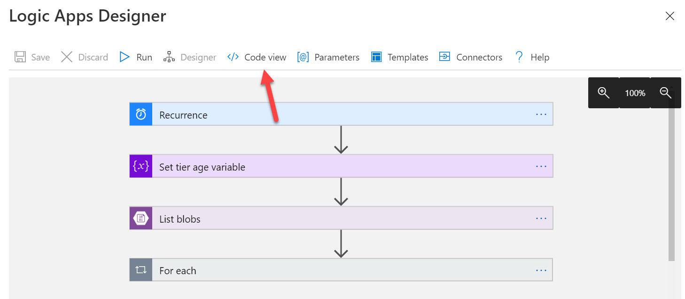

# Logic App

- Build your own workflows
- It's an `Low Code` alternative to `Function Apps`
- Uses the **Logic App Designer** to define the workflow
- A `Trigger` can be defined which perform some `steps` and `actions`
- Actions can take place in external system using the `connectors`
- `Standard` (app service) or `Consumption` (serverless)
- <https://docs.microsoft.com/en-us/azure/connectors/apis-list>

## Workflow examples

- Whenever an administrative action is performed on a VM, mail an administrator and trigger a function app
- Automatically change the blob tier based on last modified time
  1. Recurrence on daily basis
  1. Set the tier age variable
  1. Get list of Blobs in container
  1. Scan all the blobs in the container
     - Set an action if the condition is true
     - Set an action if the condition is false
- Telemetry
  1. Create a blank logic app
  1. Add a `trigger` to the logic app which will fire when one or more messages arrives in the queue
  1. Create an `action` to read the IoT temperature data.
  1. Set a `condition` that compares the temperature against the upper and lower thresholds.
  1. Create an action that sends an email to the specified personnel.

## Logic App Designer

- Each trigger created in Logic App Designer is created as a separate `API Connection` resource



- Common Triggers

  - Service Bus Queue
  - HTTP Requests
  - Tweet
  - Event Grid event
  - Recurrence
  - Email on outlook
  - New file on onedrive
  - File added to FTP server

## JSON configuration

- The Logic app designer generates a json configuration behind the scenes


```json
{
  "external-api": {
    "type": "Http",
    "inputs": {
      "method": "POST",
      "uri": "https://www.example-api.com/api",
      "retryPolicy": {
        "type": "fixed",
        "interval": "PT10S", // retry connection every 10 seconds
        "count": "5" // try 5 times
      }
    }
  }
}
```

## Integration

- Use `Enterprise Integration Pack` to edit B2B workflows
- Use `On-premise Data Gateway` to allow Logic App to access on-premise data resources
- Use `Integration Service Environment` to secure your connection with the logic app, this environment is injected into your Azure VNet

## Debugging

- To debug a logic app you can follow the `Logic App run history`
