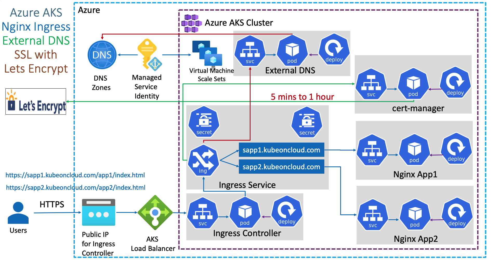

# Azure Kubernetes Service

- `Azure Kubernetes Service (AKS)`: Fully managed K8S service on Azure
- Nodes of the K8S cluster can be spread across `availability zones`

## AKS Configuration

- **Basics**
  - `Region`
  - `Version`
  - `Zones`
- **Nodepools**
  - `System Node Pools`: master nodes (created by default)
  - `User Node Pools`: worker nodes
  - `Virtual Nodes`
- **Authentication**
  - `System Assigned Managed Identity`: superset of all other identities in azure
  - `Service Principal`: adds complexity (not recommended)
  - `Kubernetes RBAC`
  - `AKS Managed Azure AD`: onde enabled, cannot be disabled
- **Networking**
  - `Azure CNI`: optimized to Azure services, virtual nodes, etc
  - `Kubenet`: never use!
  - `Load Balancer`: standard by default. Must have enough outbound ips
  - `Public/Private Cluster`: enable/disable access to kube-apiserver on public
- **Integrations**
  - `Container Registry`: native integration with ACR. Optionally use service principals
  - `Azure Monitor`
  - `Azure Policy`
- **Additional**
  - `Virtual Network`
  - `Default Subnet`
  - `Virtual Nodes Subnet`
  - `SSH Public Key`

## Logs

- Integrates with `Log Analytics Workspace`
- Can be enabled in the `Integrations` tab on the Cluster creation
- In the log analytics workspace under `Logs` tab there will be a `ContainerInsights` table

```sh
# Container logs from last 24 hours
let starttimestamp=ago(1d);

ContainerLog
| where TimeGenerated > starttimestamp


# List of distinct container IDs
let ContainerIDs=KubePodInventory
| where ClusterName =="appcluster"
| distinct ContainerID;

ContainerIDs

# Logs based on container ID
let starttimestamp=ago(1d);

ContainerLog
| where TimeGenerated >starttimestamp
| where ContainerID in (ContainerIDs)

# Logs based on container ID and summarize by node name
let ContainerIDs=KubePodInventory
| where ClusterName =="appcluster"
| distinct ContainerID;
let starttimestamp=ago(1d);

ContainerLog
| where TimeGenerated >starttimestamp
| where ContainerID in (ContainerIDs)
| summarize count() by Computer
```

## AKS Load Balancer

- Whenever a `LoadBalancer` kubernetes resource is created, the following operations are done automatically in the `Azure LB`:
  - A new `AZ Public IP` is a created
  - The public IP is associated with the `AZ LB Frontend IP`
  - A new `AZ LB Rule` is created associating the frontend ip with the backend pool

## External DNS

- Cloud Providers are integrated with Kubernetes so that when an Ingress with a new DNS is created, it is automatically registered in the `Cloud DNS Server` (E.g., DNS Zone in Azure)
- `ExternalDNS` synchronizes exposed Kubernetes Services and Ingresses with DNS providers.
- [ExternalDNS](https://github.com/kubernetes-sigs/external-dns) allows you to control DNS records dynamically via Kubernetes Resources (DNS-provider-agnostic).
- In order to manage `DNS records` automatically, permissions to the external dns pods must be given (by means of a `User-assigned Managed Identity`)

```yaml
apiVersion: apps/v1
kind: Deployment
metadata:
  name: external-dns
spec:
  strategy:
    type: Recreate
  selector:
    matchLabels:
      app: external-dns
  template:
    metadata:
      labels:
        app: external-dns
    spec:
      serviceAccountName: external-dns
      containers:
        - name: external-dns
          image: registry.opensource.zalan.do/teapot/external-dns:latest
          args:
            - --source=service
            - --source=ingress
            #- --domain-filter=example.com # (optional) limit to only example.com domains; change to match the zone created above.
            - --provider=azure
          #- --azure-resource-group=externaldns # (optional) use the DNS zones from the specific resource group
          volumeMounts:
            - name: azure-config-file
              mountPath: /etc/kubernetes
              readOnly: true
      volumes:
        - name: azure-config-file
          secret:
            secretName: azure-config-file # Azure config file with the service identity
```

- azure-config-file

```json
{
  "tenantId": "000-000-000-000-000",
  "subscriptionId": "000-000-000-000-000",
  "resourceGroup": "dns-zones",
  "useManagedIdentityExtension": true,
  "userAssignedIdentityID": "000-000-000-000-000" // client id of the identity created
}
```

1. Register domain in Domain Registrar
1. Create Azure DNS Zone resource with the domain name (e.g., hvitoi.com)
1. Change NameServer in the domain registrar to AzureDNS
1. Create a User-Assigned Managed Identity and give it permission to the resource group containing the DNS Zone
1. Associate the identity with the VMSS running the AKS workers (identity tab in vmss)
1. Deploy the Ingress resource with the domain
1. `A` and `TXT` records are automatically created in the DNS Zone



## AKS Virtual Nodes

- With `Virtual Nodes`, we can run kubernetes workloads on `serverless infrastructure`
- Virtual nodes are enabled at the AKS cluster creation
- Virtual nodes require `Azure CNI networking`
- Pods created in kube-system ns to integrate the virtual node
  - `aci-connector-linux`
  - `azure-cni-networkmonitor`
  - `azure-ip-masq-agent`
- Scaling pods in a virtual node is much faster!

- **Virtual Nodes** = `Virtual Kubelet` + `ACI` (azure container instance)
- **Virtual Kubelet**
  - Open source kubelet implementation that acts as a kubelet
  - Allow `serverless container platforms` to be a worker node! E.g., Azure ACI, AWS Fargate
  - The `Virtual Kubelet ACI provider` makes of the ACI instance a regular kubernetes node
- **Azure Container Instances**
  - Hosted environment for running containers
  - No need to manage the underlying compute infrastructure


- Disadvantages
  - Init containers won't work
  - Azure Disk Storage Class won't work
  - DaemonSets won't deploy to virtual nodes

```yaml
# schedule pods to the virtual node
nodeSelector:
  kubernetes.io/role: agent
  beta.kubernetes.io/os: linux
  type: virtual-kubelet
tolerations:
  - key: virtual-kubelet.io/provider
    operator: Exists
  - key: azure.com/aci
    effect: NoSchedule
```

## HTTP Application Routing

- **HTTP Application Routing** if activated at the AKS cluster creation, Azure automatically deploys and configure a `Ingress Controller` and `External DNS` in the cluster
- The DNS zone is automatically created with a sample domain. E.g., `8273913.centralus.aksapp.io`
- Should not be used in production!
- The annotation `kubernetes.io/ingress.class: addon-http-application-routing` must be used in ingress resource
- Pods create in kube-system
  - addon-http-application-routing-nginx-ingress-controller
  - addon-http-application-routing-external-dns
  - addon-http-application-routing-default-http-backend

```sh
# HTTP Application Routing
az aks enable-addons \
  --resource-group "aks-rg" \
  --name "aks" \
  --addons "http_application_routing"
```

### Active Directory Authentication


1. Create a group in AD (E.g., k8s-admins)
1. Create a user in the newly created group
1. Enable `AKS-managed Azure Active Directory` under `AKS Cluster Configuration` and set the AD group as admin
1. az aks get-credentials ...
1. Request a cluster resource and it will prompt to enter login + pass. This will be cached in the kubeconfig for further requests

```yaml
# User in kubeconfig ...
- name: clusterUser_aks-rg_aks
  user:
    auth-provider:
      name: azure
      config:
        apiserver-id: 000-000-000-000-000
        tenant-id: 000-000-000-000-000
        client-id: 000-000-000-000-000
        config-mode: "1"
        environment: AzurePublicCloud
```

- Even if AD authentication is enabled, you can bypass it and log as a standard k8s admin with `az aks get-credentials --resource-group aks-rg --name aks-cluster --admin`

```sh
# Get Azure AKS Cluster Id
AKS_CLUSTER_ID=$(az aks show --resource-group aks-rg --name aks-cluster --query id -o tsv)
echo $AKS_CLUSTER_ID

# Create Azure AD Group
DEV_AKS_GROUP_ID=$(az ad group create --display-name devteam --mail-nickname devteam --query objectId -o tsv)
echo $DEV_AKS_GROUP_ID

# Create Role Assignment (This group will be part of AKS cluster)
az role assignment create \
  --assignee "$DEV_AKS_GROUP_ID" \
  --role "Azure Kubernetes Service Cluster User Role" \
  --scope "$AKS_CLUSTER_ID"

# Create Dev User
DEV_AKS_USER_OBJECT_ID=$(az ad user create \
  --display-name "john" \
  --user-principal-name "john@awesome.onmicrosoft.com" \
  --password "pass" \
  --query "objectId" \
  --output "tsv")
echo $DEV_AKS_USER_OBJECT_ID

# Associate Dev User to Dev AKS Group
az ad group member add \
  --group "devteam" \
  --member-id "$DEV_AKS_USER_OBJECT_ID"
```

## Cluster Autoscaler

- Scale `out` or `in` the `nodes` in the `nodepool`
- Scales when
  - Pods with insufficient resources
  - Nodes underutilized for a extended period of time
- Can be configured at the `aks nodepools` settings
