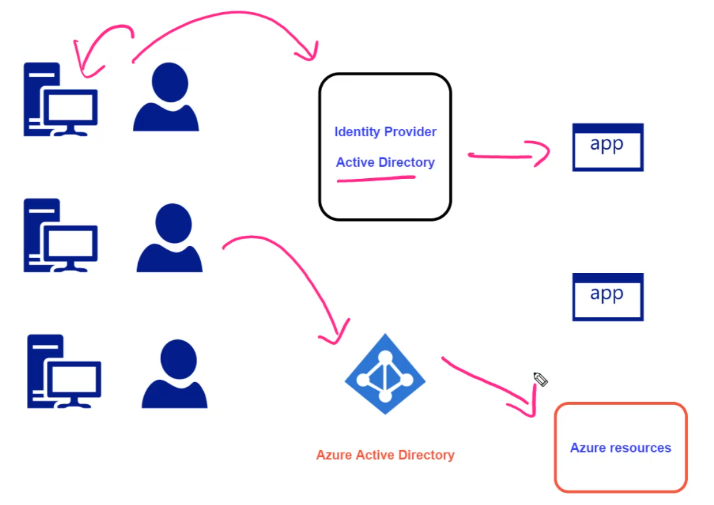

# Azure Active Directory

- Azure AD is an `Identity Provider`
- Allows users to sign in and access resources in Azure Portal, Office 365 and other SaaS applications
- Uses the `Active Directory Authentication Library` (ADAL)
- `Azure AD` is automatically created when creating your Azure Account (`Default Directory`)
- `Active Directory` is also known as `Tenant`.
- An `AD`/`Tenant` can be associated with one or more `domains` E.g., `@hvitoioutlook.onmicrosoft.com`
- The directories contain `users`, `groups` and `applications`



## Licenses

- `Free`
- `Office 365 Apps`
- `Premium P1`: $6 per user per month
- `Premium P2`: $9 per user per month

- In order to buy the license, users need to be part of a `custom domain`
  - Users cannot purchase licenses in the default directory
  - And it must have role of `billing administrator`

## Entities

- **User**

  - New users must be assigned to a domain (`tenant`/`AD`)
    - <henrique@hvitoioutlook.onmicrosoft.com >
  - Roles
    - `Global Administrator`
    - `User Administrator`
    - `Billing Administrator`
  - The roles in AD apply only to manage the AD itself! Not the resources

- **Group**

  - `Dynamic groups`: assign a user automatically. Evaluate attributes of a user and then add it to a group. E.g., city

- **Application**

  - Also known as `Service Principal` or `Application Object`
  - Has an `Client Id`
  - A `Role` can be assigned to the client Id
  - Then is given the application permissions to access multiple resources (E.g., ACR)

  ```shell
  # Assign to the "Service Principal" permissions to pull images from ACR
  az role assignment create \
    --assignee $CLIENT_ID \
    --scope $ACR_ID \
    --role "acrpull"
  ```

## RBAC (Role-based access control)

- Provides `authorization` to the Azure Resources that are part of a Subscription
- The RBAC is configured via `Identity Access Manager (IAM)`

## Devices

- Register devices with `AZ Join`. E.g., phones, laptops, etc
- This way you can log in with your credentials to Azure AD with your personal laptop, for example.

## User Password Reset

- `Manual password reset`
- `Self-Service Password Reset`: The own user select a method to recover its password

## Multi-Factor Authentication

- In order to implement MFA, you must implement `Conditional Access Policies` (Requires Azure AD Premium P2+)
  - Enable under `Security`/`Conditional Access`
- Conditional Access example: for all users logging in to the demo-app require the MFA


## Managed Identities

- Provides the necessary implementation for Azure AD authentication. Applications may use the managed identity to obtain Azure AD tokens
- You can use managed identities to authenticate to any resource that supports Azure Active Directory authentication including your own applications.
- It can be enabled for `VMs`, `App Services`, `Functions`, `Containers` and others

- **Managed identity types**

  - `System-assigned Managed Identity`
    - When the resource is deleted, Azure automatically deletes the identity in Azure AD for you (shared lifecycle)
    - Can be used only for that particular service.
  - `User-assigned Managed Identity`
    - Can be assigned to one or more instances of an Azure service
    - The identity is managed separately from the resources that use it
    - It's a standalone Azure resource
  - Supports
    - `Service Principal authentication`
    - `Managed Identity authentication`
    - `User Principal authentication`
  - It's enabled under `Identity` tab
    - The resource will be then **registered in Azure AD**
    - It's assigned an `Object ID` for that resource
    - Once it is registered, the resource can be granted permissions to access resources protected by Azure AD.

## Access Token

- **Getting access token manually**

- In order to authenticate, you must request an oauth2 `access token` to the `Managed Identity Service` that lives inside of the resource that you registered in Azure AD, e.g., vm, webapp, etc

```cs
// Create request
HttpWebRequest request = (HttpWebRequest)WebRequest.Create("http://169.254.169.254/metadata/identity/oauth2/token?api-version=2018-02-01&resource=https://storage.azure.com/"); // Request to Azure AD
request.Headers["Metadata"] = "true";
request.Method = "GET";

// Get response
HttpWebResponse response = (HttpWebResponse)request.GetResponse();
StreamReader streamReader = new StreamReader(response.GetResponseStream());
string fullResponse = streamReader.ReadToEnd();
Console.WriteLine("This is the response");
Console.WriteLine(fullResponse);

// Get access token from response
Dictionary<string, string> list = (Dictionary<string, string>)(JsonSerializer.Deserialize<Dictionary<string, string>>(fullResponse));
string accessToken = list["access_token"];
Console.WriteLine("Just the access token");
Console.WriteLine(accessToken);
```

```powershell
# Get access token
$response = Invoke-WebRequest `
  -Uri 'http://169.254.169.254/metadata/identity/oauth2/token?api-version=2018-02-01&resource=https%3A%2F%2Fmanagement.azure.com%2F'
  -Headers @{Metadata="true"}

$content =$response.Content | ConvertFrom-Json
$access_token = $content.access_token

# Get VM info
$vmInfo = (Invoke-WebRequest `
  -Uri 'https://management.azure.com/subscriptions/subscription-id/resourceGroups/new-grp/providers/Microsoft.Compute/virtualMachines/demovm?api-version=2017-12-01' `
  -Method GET -ContentType "application/json" `
  -Headers @{ Authorization ="Bearer $access_token"}).content

echo $vmInfo
```

- **Getting access token via Azure.Identity library**

- Example: Accessing a storage account resource

```cs
private static string blobUrl = "https://hvitoi.blob.core.windows.net/data/sample.txt"; // The protected resource to be accessed
private static string downloadPath = "/home/sample.txt";
static void Main(string[] args)
{
  // Get token Credential for the current resource
  TokenCredential tokenCredential = new DefaultAzureCredential(); // or new AzureServiceTokenProvider()

  // Access the protected resource
  Uri blob_uri = new Uri(blobUrl);
  BlobClient blobClient = new BlobClient(blob_uri, tokenCredential);
  BlobDownloadInfo blobDownloadInfo = blobClient.Download();

  using (FileStream fileStream = File.OpenWrite(downloadPath))
  {
    blobDownloadInfo.Content.CopyTo(fileStream);
    fileStream.Close();
  }
  Console.WriteLine("File download complete");
}
```

- Example: Accessing a key vault resource

```cs
private static string keyVaultUri = "https://hvitoi.vault.azure.net/";
private static string secretName = "dbpassword";
static void Main(string[] args)
{
  TokenCredential tokenCredential = new DefaultAzureCredential();
  SecretClient secretClient = new SecretClient(new Uri(keyVaultUri), tokenCredential);
  var secret= secretClient.GetSecret(secretName);
  Console.WriteLine($"The value of the secret is {secret.Value.Value}");
}
```
