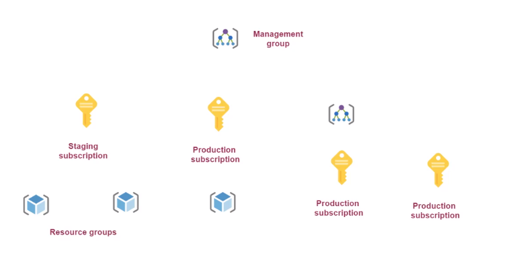

# Management group

- Group subscriptions together
- `Access control (IAM)` and `Policies` can be applied at the root level
- Management groups can be nested
- By default, there is `Tenant Root Group`

