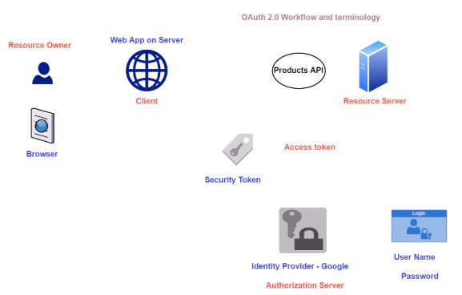
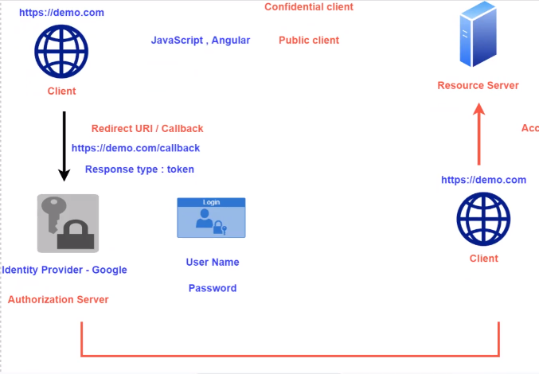
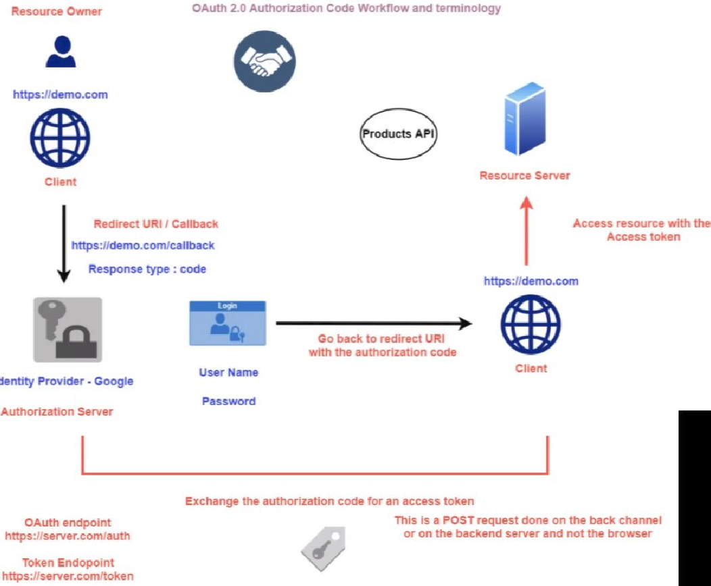

# OAuth 2.0

- `OAuth 2.0` is the industry-standard protocol for authorization (and authentication)
- `OpenID Connect` is the industry-standard protocol for authentication only
- Gives permissions to the `application object`

- **OAuth entities**

  - `Resource Owner`: the user logged in
  - `Client`: the application that requests a token to the authorization server in behalf of the resource owner
  - `Access Token`: security token requested by the client in order to access the resource server
  - `Authorization Server`: it's the identity provider, it issues the authorization codes and the access tokens. E.g., Azure AD
  - `Resource Server`: server that hosts the protected resource. Access is only granted with the use of access tokens. E.g., Storage Account



## Grant Types

- `Password Grant (legacy)`: username + password
- `Client Credentials`: client_id + client_secret
- `Authorization Code`: client_id + redirect_uri
- `PKCE`
- `Refresh Token`

- To get the `OAuth 2.0 token endpoint` go to the application object under the option `Endpoints`

  - E.g., <https://login.microsoftonline.com/tenant-id/oauth2/token>

### Client Credentials

- Used by clients to obtain an access token outside of the context of the user
- No user login prompt
- The client credentials are passed directly

```shell
curl --location --request GET 'https://login.microsoftonline.com/tenant-id/oauth2/token' \
  --header 'Content-Type: application/x-www-form-urlencoded' \
  --form 'grant_type="client_credentials"' \
  --form 'client_id="client-id"' \
  --form 'client_secret="client-secret"' \
  --form 'resource="https://storage.azure.com"' # The protected resource (a access token is valid only for this resource)
```

- In order to access a resource, you must pass the access token under the `Authorization` header and the api version under `x-ms-version` (E.g., 2017-11-09)

```shell
# resource="https://storage.azure.com"
curl --location --request GET 'https://hvitoi.blob.core.windows.net/{container-name}/sample.txt' \
--header 'Authorization: Bearer bearer-token' \
--header 'x-ms-version: 2017-11-09'
```

```shell
# resource="https://vault.azure.net"
curl --location --request GET 'https://hvitoi.vault.azure.net/secrets/{secret-name}/{secret-version}?api-version=7.1' \
--header 'Authorization: Bearer bearer-token' \
--header 'x-ms-version: 2017-11-09'
```

```shell
# resource="https://graph.microsoft.com"
curl --location --request GET 'https://graph.microsoft.com/v1.0/users' \
--header 'Authorization: Bearer bearer-token' # Retrieve data about all AD users
```

### Implicit Flow

- Used for applications that have no server-side component and runs completely on the browser (single-page applications)

- Query parameters:
  - `response_type`: must be "token". Tells the authorization server to initiate the implicit flow
  - `redirect_uri`: where to send the access token to
  - `client_id`: public identifier of the application
  - `scope`: which permissions the application is requesting
  - `state`: random string (prevent CSRF attacks)



### Authorization Code

1. **Get authorization code** (frontend application - GET request)

   - The code is sent to the redirect URI, which is part of the application
   - Query parameters:
     - `response_type`: must be "code". Means that client is performing an **Oauth 2.0 Authorization Code Workflow**. Returns the authorization code to the redirect uri
     - `redirect_uri`: where to send the code to
     - `client_id`: public identifier of the application
     - `scope`: which permissions the application is requesting
     - `state`: random string (prevent CSRF attacks)
   - Example endpoint: <https://server.com/auth>

1. **Get access token** (backend application - POST request)

   - The application uses the code received from Azure AD to get an access token directly from the resource
   - Query parameters:
     - `grant_type`: authorization_code
     - `code`: the code from Azure AD
     - `redirect_uri`: same redirect uri used before
     - `client_id`: public identifier of the application
     - `client_secret`: application's client secret
   - Example endpoint: <https://server.com/token>



## Microsoft Authentication Library

- Library: <Microsoft.Identity.Web>
- Allow developers to acquire tokens from the Microsoft Identity Platform
  - You don't need to directly work with OAuth libraries in yor code
  - Fetch tokens on behalf of the user or application
  - Maintains a token cache and refreshes when they are about to expire
- The redirect URI must be specified at the `Application Object` under `Manage/Authentication` tab
  - Add a platform configuration: web, single-page, android, desktop, etc
  - E.g., <https://localhost:44366/signin-oidc> (login)
  - E.g., <https://localhost:44366/signout-oidc> (logout)

```xml
<ItemGroup>
  <!-- Basic connectivity with MS Identity Platform -->
  <PackageReference Include="Microsoft.Identity.Web" Version="1.9.2" />

  <!-- Graphic screen prompt for login -->
  <PackageReference Include="Microsoft.Identity.Web.UI" Version="1.9.2" />

  <!-- Policy builder authorization -->
  <PackageReference Include="Microsoft.AspNetCore.Identity.EntityFrameworkCore" Version="3.1.13" />

  <!-- User interface for signin/signout -->
  <PackageReference Include="Microsoft.AspNetCore.Identity.UI" Version="3.1.13" />
</ItemGroup>
```

```json
// appsettings.json
{
  "AllowedHosts": "*",
  "AzureAd": {
    "Instance": "https://login.microsoftonline.com/", // authorization server
    "TenantId": "tenant-id",
    "ClientId": "client-id",
    "CallbackPath": "/signin-oidc", // route that receives the code (redirect uri  )
    "SignedOutCallbackPath": "/signout-oidc"
  },
  "ConnectionStrings": {
    "OAuth_2ContextConnection": "Data Source=OAuth-2.db"
  }
}
```

```cs
public class Startup
{
  public Startup(IConfiguration configuration) { Configuration configuration; }
  public IConfiguration Configuration { get; }

  // Add services to the container
  public void ConfigureServices(IServiceCollection services)
  {
    services.AddControllersWithViews();

    // Set up scope of access that the consent screen will ask to the user (not necessary for ID tokens)
    string[] scopes = new string[] { "https://storage.azure.com/user_impersonation" }; // user_impersonation: use all roles assigned to the logged in user

    // "AzureAd" stores the configuration to connect to the authorization server
    services
      .AddMicrosoftIdentityWebAppAuthentication(Configuration, "AzureAd")
      .EnableTokenAcquisitionToCallDownstreamApi(scopes)
      .AddInMemoryTokenCaches();

    services.AddRazorPages().AddMvcOptions(options =>
    {
      var policy = new AuthorizationPolicyBuilder().RequireAuthenticatedUser().Build();
      options.Filters.Add(new AuthorizeFilter(policy));
    }).AddMicrosoftIdentityUI(); // user interface for signin/out
  }

  // Configure the HTTP request pipeline
  public void Configure(IApplicationBuilder app, IWebHostEnvironment env)
  {
    if (env.IsDevelopment())
    {
      app.UseDeveloperExceptionPage();
    }
    else
    {
      app.UseExceptionHandler("/Home/Error");
      // The default HSTS value is 30 days. You may want to change this for production scenarios, see https://aka.ms/aspnetcore-hsts.
      app.UseHsts();
    }
    app.UseHttpsRedirection();
    app.UseStaticFiles();

    app.UseRouting();

    app.UseAuthentication(); // protects the page
    app.UseAuthorization();

    app.UseEndpoints(endpoints =>
    {
      endpoints.MapControllerRoute(
        name: "default",
        pattern: "{controller=Home}/{action=Index}/{id?}");
    });
  }
}
```

## Open ID Connect

```cs
public void ConfigureServices(IServiceCollection services)
{
  services.AddControllersWithViews();
  services.AddAuthentication(options =>
  {
    options.DefaultScheme = CookieAuthenticationDefaults.AuthenticationScheme;
    options.DefaultChallengeScheme = OpenIdConnectDefaults.AuthenticationScheme;
  })
    .AddCookie(CookieAuthenticationDefaults.AuthenticationScheme)
    .AddOpenIdConnect(OpenIdConnectDefaults.AuthenticationScheme, options =>
      {
        options.SignInScheme = CookieAuthenticationDefaults.AuthenticationScheme;
        options.Authority = "https://login.microsoftonline.com/{tenant-id}";
        options.ClientId = "{client-id}";
        options.ResponseType = OpenIdConnectResponseType.Code;
        options.ResponseType = OpenIdConnectResponseType.IdToken;
        options.SaveTokens = true;
        options.Scope.Add("profile");
        options.Scope.Add("openid");
        options.ClientSecret = "{client-secret}";
      });
}
```
