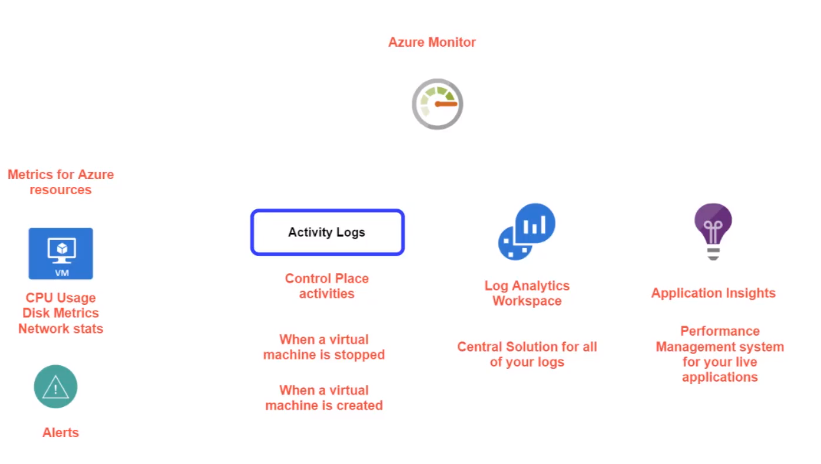

# Azure Monitor

- Azure Monitor is priced based on the data ingestion and retention

- View `Metrics` for resources
  - CPU, disk, network, ...
- `Activity logs`
  - Control plane activities
  - When a VM is stopped or created
- `Log Analytics Workspace`
  - Central solution for all your logs
- `Application Insights`
  - Performance
  - Management system for your live applications

## Activity Logs

- Log all activities that are happening in your Azure account

- Activity types

  - `Administrative`: Create, update, delete resources operations
  - `Service Health`: service health incidents
  - `Resource Health`: resource health incidents
  - `Alert`: Activation of alerts
  - `Autoscale`: autoscaling events
  - `Recommendation`: recommendations from azure advisor
  - `Security`: alerts from Azure Security Center
  - `Policy`: alerts from Azure Policy

- Logs can be sent to:
  - `Log Analytics`
  - `Storage Account`
  - `Event hub`
  - `Download (CSV)`

## Metrics

- View metrics of multiple resources
- Example metrics: Percentage CPU, Memory, Networking

## Alerting

- Alerts can be set for `metrics` or `activity logs`
- A `scope`, `condition` and `action` define a **alerting rule**
  - **Scope**: resource to be monitored
  - **Condition**: metrics threshold or administrative activity. E.g., CPU > 85% or when a VM is deleted
  - **Action**: Set of instructions to trigger. E.g., playbook, email, sms, etc
- New `alert rules` can be created based on the `query` established under the log tab
