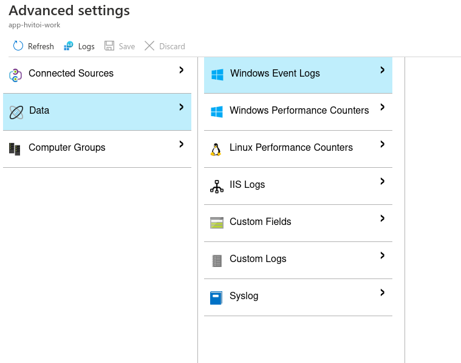

# Log Analytics Workspace

- Collects logs from VMs
- `Log Analytics Workspace` is a global resource. It monitors resources from different regions
- Each VM to be monitored must be enabled in `Log Analytics`
  - When connecting, an `agent` is installed onto the VM
  - Port TCP `8404` must be opened in the machine

## Network Performance Monitor

- `Network Performance Monitor` is a extension/solution that can be applied on top of log analytics workspace. It's activated under `workspace summary tab`
- Help monitor performance of the network infrastructure
- Detect network issues and generate alerts

- `Performance Monitor`: connectivity across azure and on-premise
- `Service Connectivity Monitor`: connectivity from users to important services

## Virtual Machines Logs

- When `connecting` to the VM, an `agent` is installed to send the logs to logs analytics
- The types of logs to be sent can be set under the `Agent configuration tab`



- On-premise machines can also be monitored! For that you must manually install the agent (`agent management tab`)

- Under `Logs tab` you can query all logs with filters and other search options

```txt
Event | search "vm"
Event | take 5
Event | top 10 by TimeGenerated
Event | where EventLevel == 4
Event | where TimeGenerated > ago(5m) | project EventLog, Computer
Perf | where TimeGenerated > ago(10m) | where Computer == "vm" | where CounterName == "Available MBytes" | summarize avg(CounterValue) by bin(TimeGenerated, 2m)
```

- Custom logs can be defined! E.g. `nginx logs` under /var/log/nginx
  - Custom logs are created under the `advanced tab`

## AKS logs

```txt
let ContainerIDs = KubePodInventory
  | where ClusterName="Cluster1"
  | distinct ContainerID

ContainerLog
  | where ContainerID in (ContainerIDs)
  | where TimeGenerated > ago(1d)
  | where LogEntrySource == "stderr"
  | summarize count() by Computer
```
