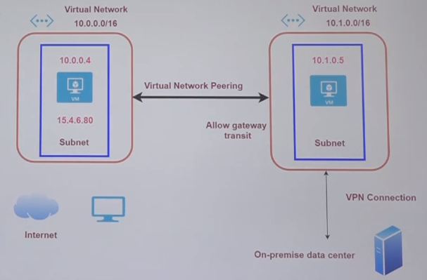
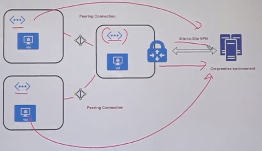

# Virtual network

- `VNet` enables many types of Azure resources, such as Azure Virtual Machines (VM), to securely communicate with each other, the internet, and on-premises networks.
- VNet can be configured to integrate a web app under `Networking tab`
- Example: Connect a `Web App` (10.0.0.0 subnet) and a `Database` (10.0.1.0 subnet) through the same `VNet`
  - This way the Web app can connect to the database with private IP address
- A `VNet` needs a `subnet` or collection of subnets
- A VNet is scoped to a `single region`

## Address Space

- The `Address Space` defines the possible values for `subnets`

- `Classless Inter-Domain Routing (CIDR)` E.g., **10.1.0.0/24**
- `Network prefix length`: 24
  - Means that the first 24 bits (out of 32) is the `Network ID` (**10.1.0**.0)
  - Then the last 8 bits (out of 32) are the `Hostnames` and can be used to assign IP addresses (10.1.0.**0**)
- New address spaces can be additionally added. E.g., 20.0.0.0/16
- Addresses with prefix length 32 means the ip is unique and fixed 10.0.0.0/32

## Subnets

- It's a split of the address space into multiple subnets. A logical organization
- E.g., Address Space `10.1.0.0/16` can have subnets:
  - 10.1.1.0/24
  - 10.1.2.0/24
  - 10.1.3.0/24
  - ...
- Subnet addresses can be modified only if no VM is assigned to it

## VNet SKU

- `Basic`
  - Static or dynamic IP address
  - NSG can be used to restrict traffic via public IP
  - No support for Availability Zones
- `Standard`
  - Static IP
  - NSG need to be used to restrict traffic
  - Zone redundant by default

## Network Peering

- `Communication between VMs` in `different VNets` under `private IP` address via the backbone network
- Azure supports connecting two virtual networks located in the same region or networks located across regions.

- Additionally, the Virtual Network Peering can `allow gateway transit` to allow secondary VPN connections to be shared among all the vnets
- The virtual networks `can't have overlapping CIDR` blocks.

  - E.g., 10.0.0.0/16 and 10.1.0.0/16 is ok. They don't overlap
  - E.g., 10.0.1.0/16 and 10.0.2.0/16 is not ok. Conflict

- To create a peering, go to `Peering tab` and select the network to connect to
  - This will create 2 peering connections, `to the remote VNet` and `from the remove VNet`

### Gateway Transit

- Allow the connections of a single VNet to be shared with peer connections
- The remote VNet serves as a gateway to the other networks
- Also known as `hub and spoke` model

