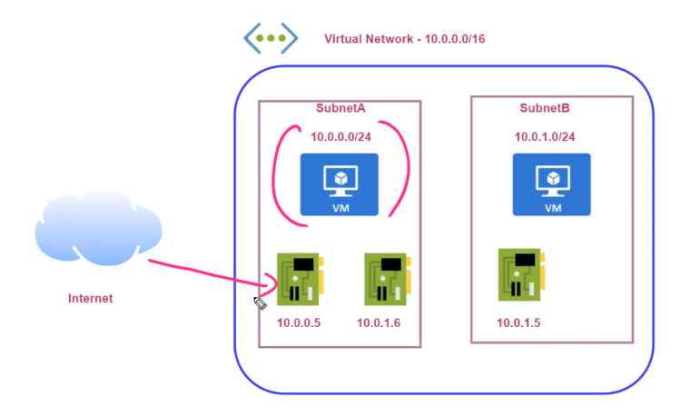

# Virtual Network Interface

- A `Virtual Network Interface` can be assigned a `Private IP` and a `Public IP`
  - The **Private IP** is used for `internal communication` between the machines in the VNet. The private IP depends on the subnet IP
  - The **Public IP** is open on the internet. The public is assigned by Azure
  - The public ip can be `disabled` on the network interface config

## Secondary Network Interface

- Second network interfaces can be used for security and compliance purposes
  - E.g., a NIC for outside traffic with public IP, and a NIC for internal communication
- The VM must be stopped to add a new NIC

