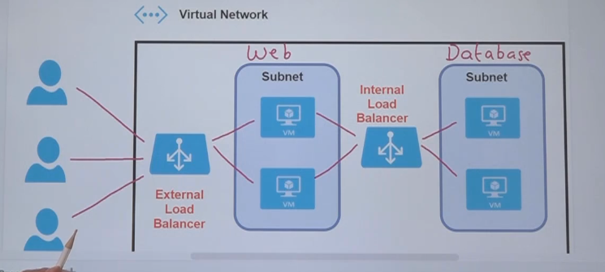
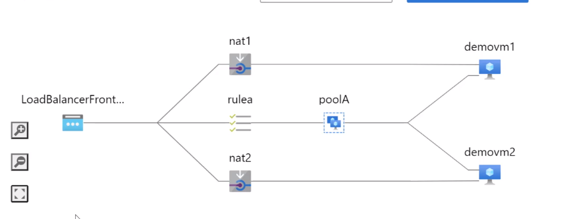

# Load balancer

- `Load balancer` can be attached to a Virtual Machine Scale Set (VMSS)
- When a new instance of VMSS is added, it's automatically added to the backend pool
- A LB must be assigned a `Public IP` (Frontend IP)

## Configuration

- A `backend pool` must be added. They are the VMs
- A `frontend IP` is the IP of the LB
- A `health probe` can be added for health check of VMs (Like a ping request, hearthbeat). The health probe is applied to test all the VMs
- A `load balancing rule` must be added with routing rules
  - front ip address, port, protocol, etc

## SKUs

- `Basic`: Single VM, Availability Set, Scale Set
- `Standard`: Multiple VMs, Availability Set, Scale Set. Provides `99.99% SLA`
  - Requires standard Public IP
  - Requires NICs to have static IP address and a NSG

## Internal vs External LBs

- `External (Public)`: Connection from outside internet
- `Internal`: Connection from within the VNet

## Inbound NAT (Network Address Translation) rules

- NAT types
  - `Static`: one private IP is mapped to one public IP
  - `Dynamic`: one private IP is mapped to a pool of public IPs
  - `PAT (Port Address Translation)`: single public IP mapped to multiple private IPs using port numbers
- When you want to specific exactly which machine you want the LB to redirect you to. For example if you want to SSH this machine
- The NAT rules is performed by specifying a port to the LB frontendIP (PAT)
  - E.g., Port 4000 (public ip) redirects to port 22 in VM1 (private ip), Port 4001 (public ip) redirects to port 22 in VM2 (private ip)

## Load Balancer Diagnostic logs (Basic LB)

- Diagnostic logs can be activated under `Diagnostic settings tab`
- 2 log entries that can be generated
  - `LB Alert Event` (continuously)
  - `LB Probe Health Status Health probe log` (Only if there is an issue)
- The logs can be sent to
  - `Log Analytics Workspace`
  - `Storage Account`
  - `Azure Event Hub`

## Load Balancer Metrics (Standard LB)

- Access under `Metrics tab`
- Metrics
  - `Health Probe Status`
  - `Data Path Availability`
- Charts can be displayed to visualize the logs

## Load Balancer Insights

- This feature is provided as part of `Azure Monitor`
- Accessible under `Insights tab`
- Features
  - Visualize the design of the LB
  - Detail metrics of the LB: Availability, Throughput, Flow Distribution, Latency

