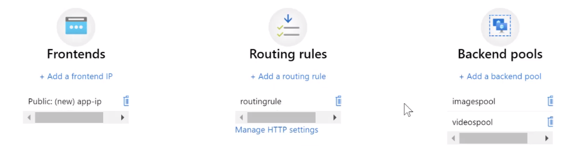
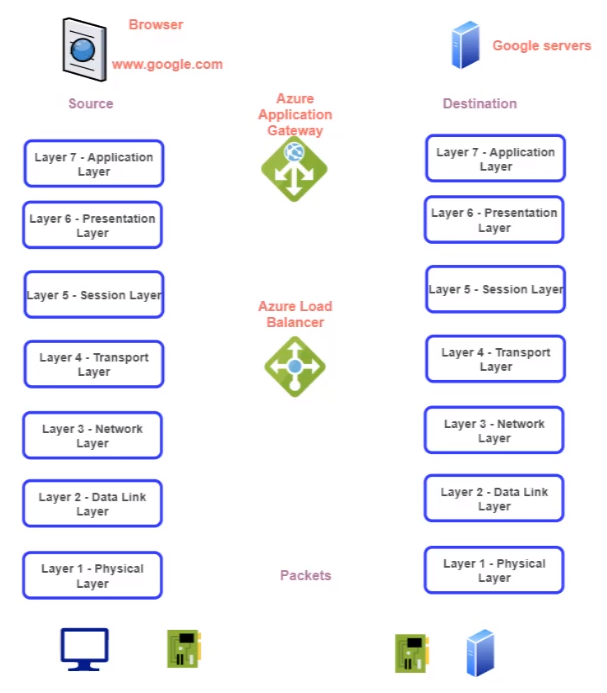

# Application Gateway

- Web traffic LB to distribute traffic to web applications
- Web Apps can reside in VM, VMSS or on-premise servers
- The `Application Gateway` is an `OSI Layer 7 LB` (At this layer the info is understandable, e.g., the path)
- Support for `Secure Sockets Layer` (SSL/TLS)
- `Autoscaling` can be enabled for the AG
- `Web Application Firewall` can be enabled for the AG
- `Session Afinity` can be enabled'
- An `empty subnet` is necessary for the AG

## Components

- `Frontend IP`: access to the gateway
- `Listener`: Logical entity that checks for incomings requests. There can be multiple listeners
  - `Basic listener`: listen to a single domain site
  - `Multi-site`: listen and map to multiple domain sites
- `Routing rules`: Route traffic from the listener to the backend pool
  - `Basic routing rule`: all requests to to the backend pool directly
  - `Path-based routing rule`: requests are routed based on the URL of request
- `Backend pools`: NICs, VMSS, Public IP, Internal IP, SQDN, etc
- `Health probes`: Defines how the AG will monitor health of the resources in backend pool

## Application Gateway vs. Load Balancer

- **Load Balancer**

  - Simply redirects traffic to backend pool (machines)
  - LB 4

- **Application Gateway**

  - Redirects traffic to a specific backend pool based on `routing rules` (E.g., the path of the request /images, /videos)
  - LB 7

## OSI Model

1. Physical
1. Data Link
1. Network
1. Transport
1. Session
1. Presentation
1. Application

