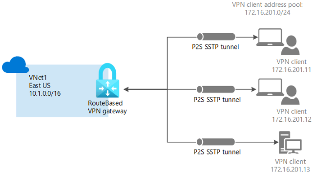
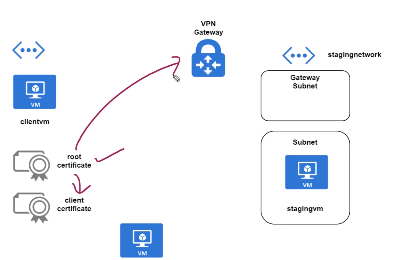
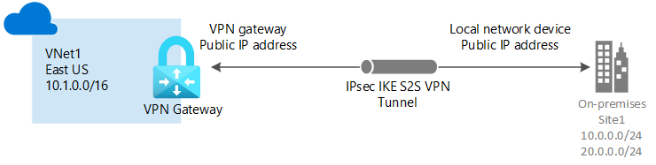
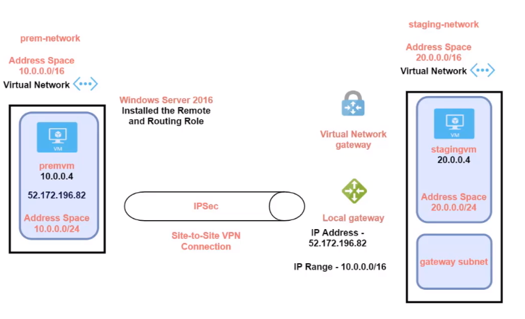
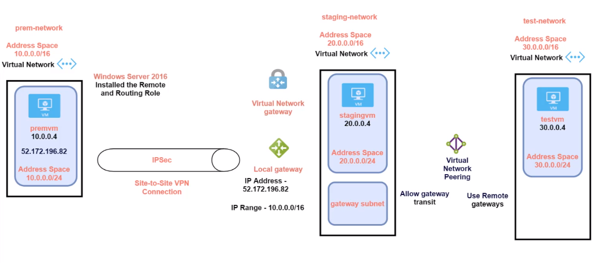
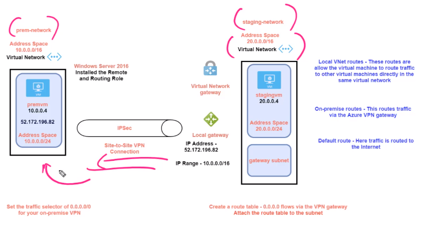

# Virtual Network Gateway

- A gateway subnet can only be associated with `VNets` in the `same region`

## Point to Site VPN Connection

- A `Point-to-Site VPN` connection is used to establish a secure connection (via private IP) between multiple client machines and an Azure virtual network via the Internet.
- The subnet need to have a `gateway subnet` that contains a subnet of the VNet address space
  - The gateway subnet can be created under the `Subnet tab` in VNet resource. Usually it is in the form `10.0.0.0/27`
- With the gateway subnet in place, the `virtual network gateway` resource can be created

### Certificates

- The host machine must generate the `root certificate` (selfsigned)
  - The root certificate must be exported and `installed in the VNet gateway`
- The host machine must have a client certificate (signed by the root certificate)
  - All the machines that want to connect to the VNet gateway must have the client certificate
- The host machine must install the `client gateway` software to order to connect to the VPN

## Site to Site VPN Connection

- A `Site-to-Site VPN connection` is used to establish a secure connection between an on-premise network and an Azure network via the Internet.
- When you want to connect a entire on-premise datacenter onto Azure VNet
- In comparison with Point-To-Site, Site-To-Site needs additionally a `local network gateway`, which is a representation of the on-premise environment

- You need to have a gateway subnet defined in your VNet for the VPN connection.
- The `local network gateway` needs to be the address range of the `on-premise` network.

### Gateway Transit

- VM-A: On-premise, VM-B: Azure VM, VM-C: Additional Azure VM

- To allow gateway transit, it must be enabled in the VNet config (of the VM that will act as a hub)
  - VM-B must have peering connection with VM-C
  - VM-B must have `gateway transit` allowed in peering config
  - VM-C must enable `use remote gateways`
  - VM-A must have static route configured

## Forced Tunneling

- Force a connection to pass through a network first before reaching the Internet
- For security and compliance purposes
- A `route table` must be created and attach it to the VM subnet

