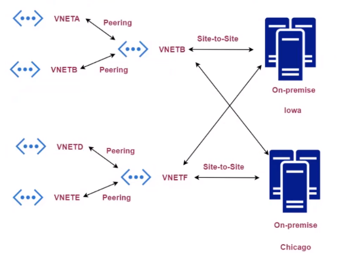
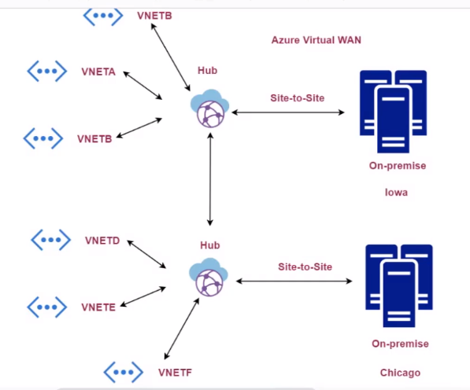

# Virtual WAN

- Problem
  

- Solution
  

- The `Hub` can take `peering connections`, `site to site VPN connections`, `point to site VPN connections` and `ExpressRoute connections`
- Hubs can be connected together
