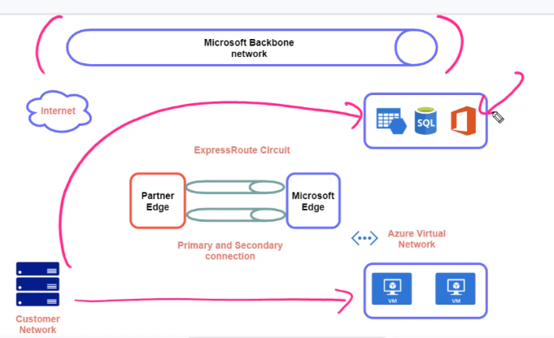

# Express Route

- Connect on-premise server to azure network with a dedicated link
- It's a high speed alternative to site to site VPN connection
- ExpressRoute `does not use Internet`, instead uses a `ExpressRoute Circuit`

- ExpressRoute port types

  - `ExpressRoute Direct`: 100Gbps
  - `Connectivity Provider`: 50Mbps or 100Mbps. E.g., vodafone, at&t, oracle, etc

- Billing methods
  - `Unlimited data`: monthly fee
  - `Metered data`: inbound free, outbound based on GB
  - `Premium Add-on`: can connect to resources across other regions

## Peerings

- `Azure private`: Requires a VNet Gateway in Azure (choose option ExpressRoute)
- `Azure public`
- `Microsoft`

## Client requirements

- Customer Network
- Private IP addresses (10.0.1.0/24)
- Public IP addresses (65.100.191.240/30)
- ASN - Autonomous System Number (38744)
