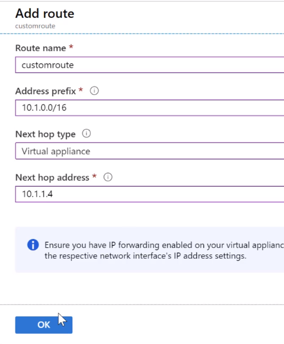
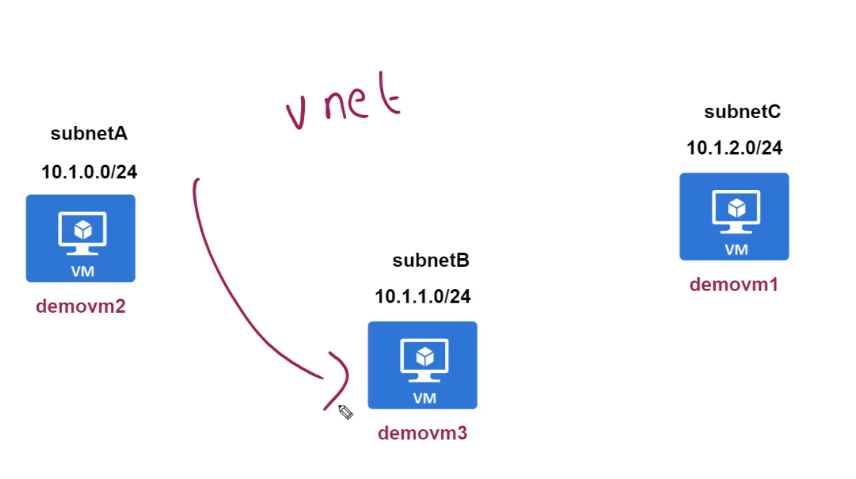

# Route Table

- A route table contains a set of rules, called routes, that specifies how packets should be routed in a virtual network.
- **User Defined Routes**
- The routes must be associated with the subnets

- The `next hop address` with `next hope type` defines to which VM the traffic of a VNet must pass through
