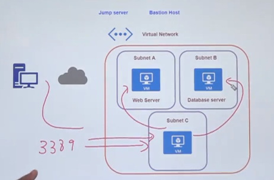
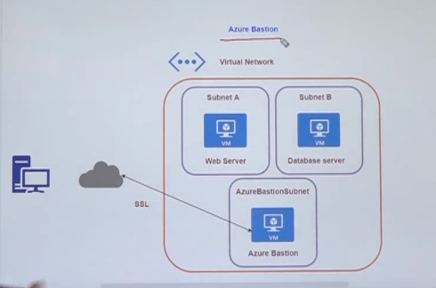

# Jump server

- A way to avoid leaving admin ports (SSH-22, RDP-3389) open to the Internet
- You create another VM, the `Bastion` and allow it to access the other remote machines via private address

## Bastion

- Azure Bastion Service enables you to securely and seamlessly RDP & SSH to your VMs in your Azure virtual network, without exposing a public IP on the VM, directly from the Azure portal, without the need of any additional client/agent or any piece of software.
- Azure service which you can use to securely log into your VMs

- With Bastion you can access the VM via browser
