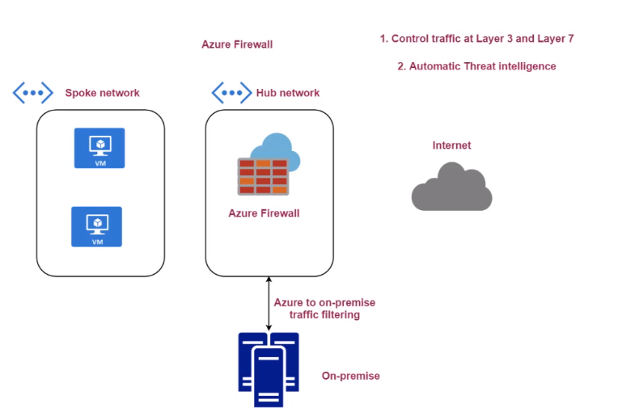

# Azure Firewall

- Controll the traffic at `Layer 3` and `Layer 7`
- Automatic threat intelligence
- Requires a subnet named `AzureFirewallSubnet`
- The Firewall is tied to a VNet
- A Firewall is tied to a `Route table`, which redirects all traffic to the Firewall

## Rules

- Rules can be added for the `Firewall Policy` resource
  - `DNAT rules`
  - `Network rules`
  - `Application rules`
