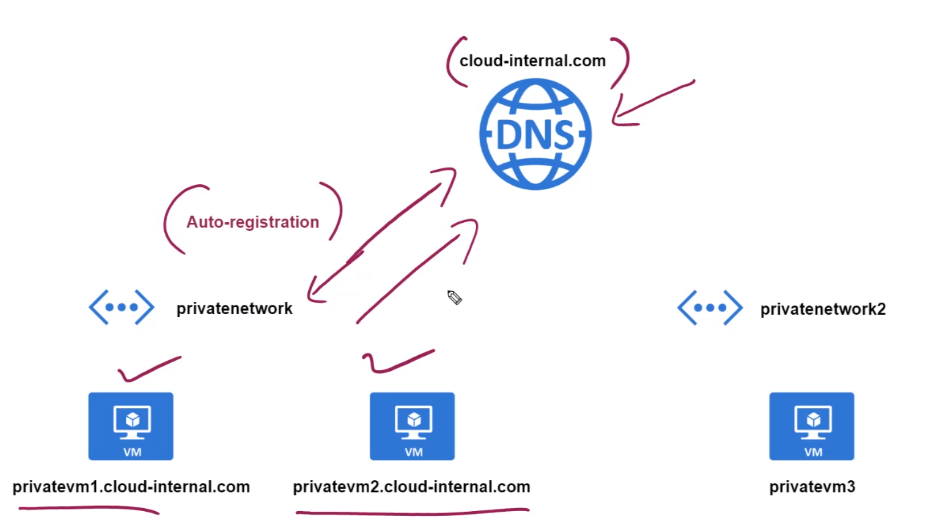

# Private DNS Zone

- DNS routing within the VNet itself
- When you create a `private DNS zone` you then link it to a VNet
- `Auto registration` can be enabled: assign DNS automatically when spin up a VM
- The resource `private dns zone` must match your desired DNS (cloud-internal.com)

## Virtual network links

- Link a VNet to an internal DNS
- `Auto registration` can be enabled here
- If auto registration is not enabled, one must manually `add a record set` (type A)

## Set up your own DNS service in your machine

- A DNS server must be installed in the host machine
- The machine hosting the DNS server must be specified in `VNet` `DNS servers config`, select `custom`
- All the VMs must be restarted
