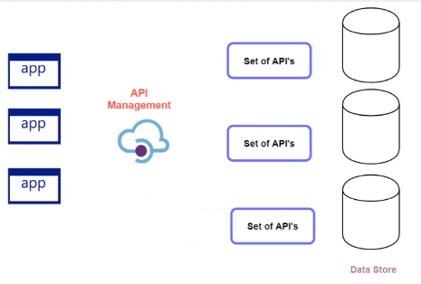
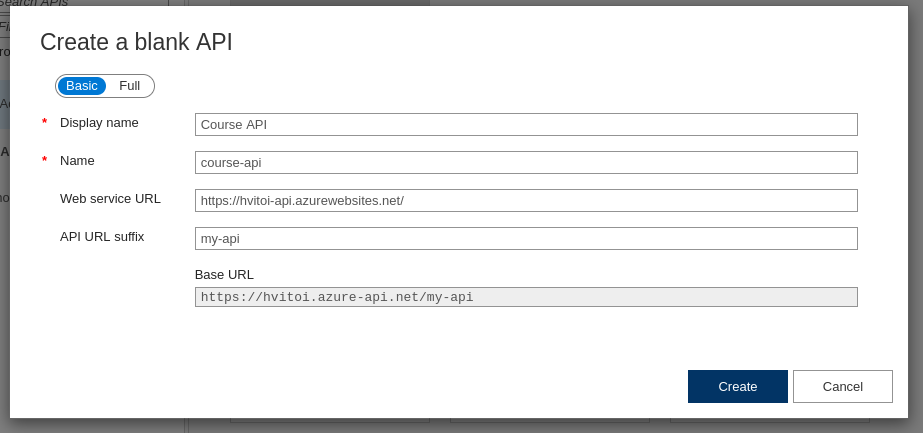
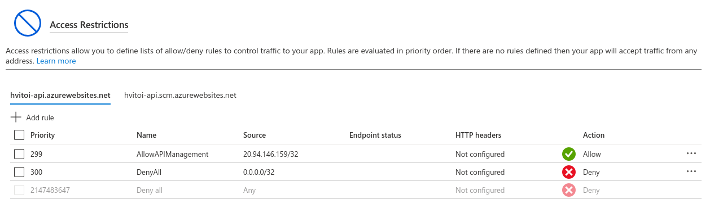
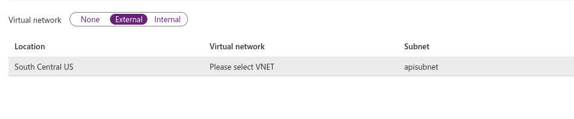

# API Management Service

- API (Application Programming Interface) is a computing interface that defines interactions between multiple software intermediaries
- It defines the kinds of calls or requests that can be made, how to make them, the data formats that need to be used, conventions,etc
- <https://hvitoi.azure-api.net>

- `Benefits`
  - Easier management of your APIs
  - You can change the behavior of your APIs via policies
  - You have built-in cache
  - You can implement better security for your APIs (verify API keys, JWT tokens and certificates)
  - Enforce usage quotas and rate limits



## API definitions

- `OpenAPI`: Standard, language-agnostic interface to REST APIs
- `WADL`: Standard XML representation of your RESTful API
- `WSDL`: Standard XML representation of your SOAP API

## New API



- `Operations`
  - You have to set each operation for the API
  - The operations can be set up with the contract
    - GET /api/Course
    - GET /api/Course/{id}
    - POST /api/Course
- `API URL suffix`
  - Suffix after the API gateway URL
  - E.g. <https://hvitoi.azure-api.net/my-api>

## Access Restrictions

- After the API has been virtualized in the API Gateway, you can know restrict access to the source API
- In the `App Service` resource -> `Networking` -> `Access Restrictions`
- Add a `rule` to:
  - Deny Allow Traffic from any source (priority 300)
  - Allow traffic with the API gateway (priority 299)



## Policies

- <https://docs.microsoft.com/en-us/azure/api-management/api-management-howto-policies>
- Policies are a collection of `XML statements`
- It's used to execute an operation:

  - `Inbound Processing`: Modify the request before it is sent to the backend service
  - `Outbound Processing`: Modify the response before it is sent to the client
  - `Backend`:

- **Examples**
  - Check HTTP header
  - Limit call rate by key
  - Log to Event Hub
  - Authenticate with Basic

```xml
<policies>

  <inbound>
    <!-- base policy -->
    <base />

    <!-- restrict access based on IP -->
    <ip-filter action="forbid">
        <address>92.98.44.62</address>
    </ip-filter>

    <!-- rewrite url -->
    <set-variable name="id" value="@(context.Request.Url.Query.GetValueOrDefault("courseID"))" />
    <rewrite-uri template="@{return "/api/Course/"+ context.Variables.GetValueOrDefault<string>("id");}" />

    <!-- when conditions -->
    <set-variable name="key" value="@(context.Request.Headers["Customer-Key"][0])" />
    <choose>
      <when condition="@(context.Variables.GetValueOrDefault<string>("key")=="my-customer-key")">
        <rewrite-uri template="@{
  return "/api/Course";}" />
      </when>
    </choose>

    <!-- when - otherwise -->
    <set-variable name="bodySize" value="@(context.Request.Headers["Content-Length"][0])"/>
    <choose>
      <when condition="@(int.Parse(context.Variables.GetValueOrDefault<string>("bodySize"))<512000)">
        <!-- does nothing -->
      </when>
      <otherwise>
        <rewrite-uri template ="/put"/>
        <set-backend-service base-url="http://cloudportalhub.com/api/9.1/"/>
      </otherwise>
    </choose>

  </inbound>

  <backend>
    <base />
  </backend>

  <outbound>
    <!-- base policy -->
    <base />

    <!-- modify the response -->
    <choose>
      <when condition="@(context.Response.StatusCode == 200)">
        <return-response>
          <set-status code="401" reason="Unauthorized" />
          <set-header name="WWW-Authenticate" exists-action="override">
            <value>Bearer error="invalid_token"</value>
          </set-header>
          <set-body template="none">"Invalid Request"</set-body>
        </return-response>
      </when>
    </choose>
  </outbound>

  <on-error>
    <base />
    <choose>
      <when condition="@context.Response.StatusCode == 500 && context.LastError.Message.Container("conflict")"> <!-- context.LastError can only be used on on-error section -->
        <return-response>
          set-status <!-- override response status -->
        </return-response>
      </when>
    </choose>
  </on-error>

</policies>
```

## Cache

- It's an inbound and outbound policy
- Policy: `Cache Responses`
- A duration for the cache must be specified

```xml
<policies>
  <inbound>
    <base />
    <!-- Cache #1 -->
    <cache-lookup vary-by-developer="false" vary-by-developer-groups="false" downstream-caching-type="none" />

    <!-- Cache #2 -->
    <cache-lookup type="External" downstream-caching-type="Private" />
      <vary-by-header>Authorization</vary-by-header> <!-- same cache for same authorization only  -->
    </cache-lookup>
  </inbound>
  <backend>
    <base />
  </backend>
  <outbound>
    <base />
    <cache-store duration="120" />
  </outbound>
  <on-error>
    <base />
  </on-error>
</policies>
```

## Virtual Network Connectivity

- Links the `API Management` and the `Resource to be exposed` in the same network
- This way, the resource needs only a private IP, no only is exposed to the outside world

- **External**

  - The gateway is accessible from the public internet via an `external load balancer`

- **Internal**

  - The gateway is only accessible from the virtual network via an `internal load balancer`
  - To access the API you need a `site-to-site VPN` or `ExpressRoute`

- For that, the API Management needs its own `subnet` and `public IP`

  - E.g. VNET Address Space: 10.0.0.0/16
    - Subnet 1 (resource): 10.0.0.0/24
    - Subnet 2 (gateway): 10.0.1.0/24

- Go to `Deployment + Infrastructure` -> `Virtual Network`
- The NSG needs `inbound port rule` on port `80`, `3443` and `443`



## Oauth Security

- An `Application Object` for the Postman (client) and Api-Management (Server) must be created

- **API Management application object**

  - `Expose an API`
  - `Add a scope` (api://88888888-4444-4444-4444-cccccccccccc): Course.Read
  - `App roles`: create app role to assign permission to the postman application object

- **Postman application object**

  - `API permission`: grant access to the API Management

- **API Management resource**

  - Tab `OAuth 2.0 + OpenID Connect`
  - Add OAuth 2.0 configuration
  - Select the Authorization grant types (authorization code, implicit, resource owner password, client credentials)
  - `API Settings`: security -> none, oauth 2.0, openid connect
  - `Inbound rule`:

    ```xml
    <policies>
      <inbound>

        <validate-jwt header-name="Authorization" failed-validation-httpcode="401" />

        <openid-config url="https://login.microsoftonline.com/tenant-id/oauth2/token" />

        <required-claims>
          <claim name="aud">
            <value>application-id</value> <!-- application object client id (API Management) -->
          </claim>
        </required-claims>

      </inbound>
    </policies>
    ```
