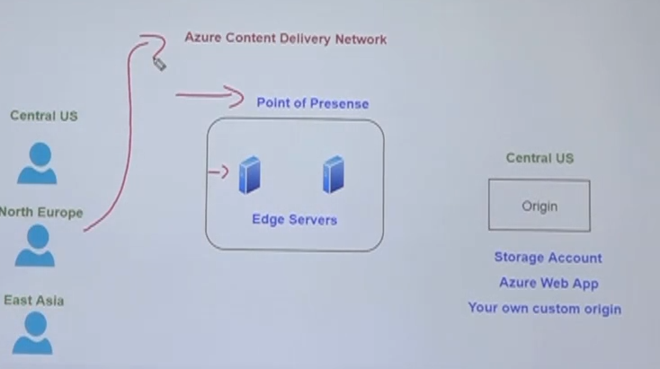

# Content Delivery Network (CDN)

- Reduce the latency to retrieve the application resources to the user
- From a cost perspective `CDN` is better then simply replicating the full application onto different regions
- `Azure CDN` takes the user request, identify the user location and then redirect the request to the closest `point of presence`, which are the `edge servers`
- `Azure CDN` is basically a set of `cache servers` spread across the globe
- The source of data is still the `origin` which is the original resource (storage account, webapp, etc)
- A `Time To Live` can be specified to the CDN content



- CDN Flow
  1. User requests resource from the `CDN URL`. The DNS then routes the request to the best performing `POP` location
  1. If none of the `POP edge servers` has the images in the cache, the POP servers then request the images from the `origin server`
  1. The `origin server` will then return the image back to the `POP edge server`. The edge server will then return the image to the user
  1. The subsequent requests for the image are then directed to the same POP server. The POP edge server returns the images from the cache if the TTL has not expired.

## Implementing

- `CDN Profile`: Details about the connection with origin
  - Pricing tiers: Microsoft, Verizon, Akamai, etc
- `CDN Endpoint`: Endpoint that expose the edge servers and pull data from origin
  - E.g., <hvitoi.azureedge.net>

## Caching Rules

- Tells how long the cache in CDN must be valid
- The `Cache-Control` goes on the header or the request

```txt
Cache-Control: must-revalidate
Cache-Control: no-cache
Cache-Control: no-store
Cache-Control: no-transform
Cache-Control: public
Cache-Control: private
Cache-Control: proxy-revalidate
Cache-Control: max-age=<seconds>
Cache-Control: s-maxage=<seconds>
```

- **Bypass**: do not cache (regardless of the Cache-Control header passed by the consumer application). Good for dynamic apps! That update content frequently
- **Override**: override cache time config (regardless of the Cache-Control header passed by the consumer application. Azure CDN will overwrite this config)
- **Set if missing**: set cache config only if it doesn't exist on the Cache-Control header

## Query strings Caching Behaviors

- `Bypass caching for query strings`: do not cache urls with query strings
- `Cache every unique URL`: cache all the URLs with its query string
- `Ignore query strings`: cache only the main pages

## ARM

- Example: Redirect only iPhone users

```json
{
  "conditions": [
    {
      "name": "isDevice",
      "parameters": {
        "@data.type": "#Microsoft.Azure.Cdn.Models.DeliveryRuleDeviceConditionParameters",
        "operator": "Equal",
        "matchValues": [
          "Mobile"
        ] /* Check if the device is mobile. Alternatively use "desktop" */
      },
      "name": "RequestHeader",
      "parameters": {
        "@data.type": "#Microsoft.Azure.Cdn.Models.DeliveryRequestHeaderConditionParameters",
        "operator": "Contains",
        "selector": "HTTP_USER_AGENT",
        "matchValues": ["iOS"]
      }
    }
  ]
}
```
