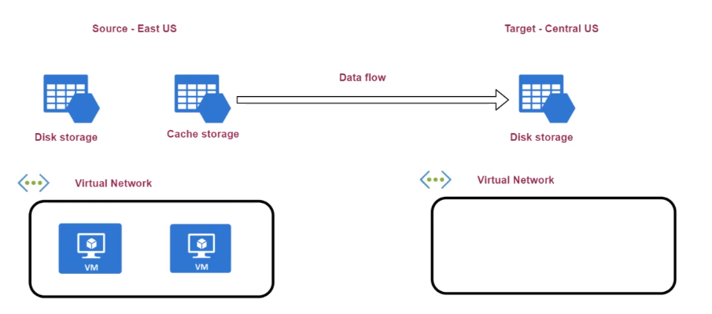

# Recovery Services Vault

- `Recovery Services vault` is a resource that hold backup data.
- It must be in the `same region` as the VM
- An `extension` must be installed to the VM. This extension is used to take `snapshots` of the disks attached to the VM
- To backup a VM, go to the `VM resource -> Operations -> Backup`
- Possible backups -> Virtual Machine, FileShare, SQL Server, SAP Hana

## Backup policy

- `Backup policy` is used to configure the schedule for the backup process.
  - E.g., everyday, retention period, etc
- `DefaultPolicy` is _daily_ with _30 days retention_

## Recover points

- A snapshot creates a `recovery point`
- A backup is composed of multiple `recovery points`

Kinds of recovery:

- `File recovery`: Mounts the backup to your personal pc and you can pick the files you want
- `VM recovery`: Create a new VM based on the backup or replace existing VM. A storage account to crete the OS disk, then the OS disk is attached to a VM.
- `Disk recovery`: Just the disk is restored

## Snapshots

Kinds of snapshots:

- `Application consistent`: Captures the memory content and the state of applications
- `Filesystem consistent`: Captures all the files at the same time
- `Crash consistent`: Happens if the VM shuts down at the backup process

## Soft deletes

- `Soft delete` protects backup data from accidental deletes
- Enables you to `recover blobs` that were previously marked for deletetion
- Keep deleted blobs for 14 days (parametrized)
- Enabled/disabled in recovery service vault properties

## Agent

- The agent is the machine which will run the backup workload
- The agent is run in `Azure` by default, but can also be run `on-premises`
  - For on-premise agent, the `recovery service agent` must be downloaded (`MARS` agent)

## Azure Site Recovery

- When a `Site Recovery` is performed, the VM continuously replicates onto a different region
- If `outage` occurs, you can `failover` the VM onto a secondary region

- **Replication policy**
  - Recovery point retention set to 24 hours (how long to keep the recovery points)
  - App-consistent snapshot to every 4 hours

- The VMs recovered by `failover` will not automatically be assigned a new public IP

## Diagnostic settings

- Option to log the backup report into `log analytics`, `storage account` or `event hub`
- Reports are shown under `backup reports tab`
