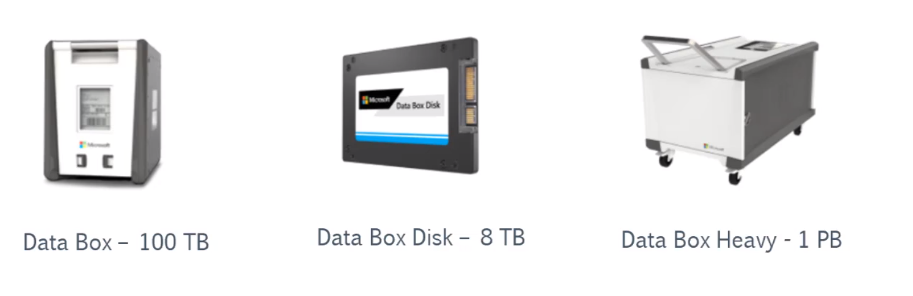

# Storage Account

- Storage account name must be `unique`
- One can use the `Azure Storage Explorer` to browse, read, write, upload data to a SA

## Storage types

- **Blob storage**

  - Object level storage. E.g., videos, images, etc
  - Blobs are stored in `storage containers` (not docker containers)
  - Blob data is stored as a binary object
  - VM `disks` are stored as blob storage (`Virtual Hard Disk (VHD)`)
  - The blob storage size increases automatically on demand
  - Types of blobs
    - `Block blob`: text and binary
    - `Append blob`: logging data
    - `Page blob`: virtual hard disk files (Standard or Premium). Can be managed or unmanaged

- **Table storage**

  - Simple table structure
  - Quick access for the data in the table

- **File storage**

  - `File shares` that can be accessed by different users and/or VMs
  - Access and create under `File Shares` tab
  - Connect using `Server Message Block (SMB)` protocol
  - `Snapshots` of the file share can be created

- **Queue storage**

  - Store messages & events

## Storage account types

- **General purpose v2 (gpv2)**: `blob (block, append, page)`, `table`, `file` & `queue`
  - For premium performance `block blob`,`page blob` and `files` only
- **General purpose v1 (gpv1)**: `blob (block, append, page)`, `table`, `file` & `queue`
  - For premium performance `block blob`,`page blob` and `files` only
- **BlockBlobStorage**: premium performance `block blob` or `append blob`
- **FileStorage**: premium performance `file` storage
- **BlobStorage**: legacy `blob` storage account

## Replication techniques

- `Locally-redundant storage (LRS)`: Data is replicated 3x within a physical location in the primary region. **3 replicas in the same data center**/
- `Zone-redundant storage (ZRS)`: Data is replicated 3x across availability zones in the primary region. **3 replicas across data centers (availability zone) in primary region**.
- `Geo-redundant storage (GRS)`: Data is replicated 3x in the primary region and asynchronously replicated to the secondary region. **3 replicas across data centers (non-availability zone) in primary region + 1 replica to secondary region**.
  - `Read access Geo-redundant storage (RA-GRS)`: GRS + the data in secondary region is available for read-only purposes
- `Geo-zone-redundant storage (GZRS)`: Data is replicated 3x across availability zones in the primary region and asynchronously replicated to the secondary region. **3 replicas across data centers (availability zone) in primary region + 1 replica to secondary region**
  - `Read Access Geo-zone-redundant storage (RA-GZRS)`: GZRS + the data in secondary region is available for read-only purposes

The replication strategy can be upgraded/downgraded

## Service Endpoint

- Use `service endpoint` to limit access onto a SA from a VNet
- On the `VM` the server endpoint must be configured (Service endpoint tab)
- ON the `SA` the access must be restricted to certain networks (Firewalls and vnets tab)
  - Allow only machines in certain IP or VNets to access the SA

## Transfer data to Storage Account

- **AzCopy Tool**

  - Command-line utility to copy blobs or files to/from SA
  - Requires a SAS URL
  - Linux/Windows/Mac: <https://docs.microsoft.com/en-us/azure/storage/common/storage-use-azcopy-v10>

  ```powershell
  # Create container
  azcopy make "https://hvitoi.blob.core.windows.net/container?sv={sas-token}"

  # Upload file/folder to container
  azcopy copy `
    "image.png" `
    "https://hvitoi.blob.core.windows.net/container/image.png?sv={sas-token}"
  azcopy copy `
    "directory/*" `
    "https://hvitoi.blob.core.windows.net/container/directory?sv={sas-token}"
  azcopy copy `
    "directory/*" `
    "https://hvitoi.blob.core.windows.net/container/directory?sv={sas-token}" `
    --recursive # Include subfolders

  # Download file/folder from container
  azcopy copy `
    "https://hvitoi.blob.core.windows.net/container/image.png?sv={sas-token}" `
    "image.png"

  # Copy file/folder between storage accounts
  azcopy copy `
    "https://hvitoi.blob.core.windows.net/container/image.png?sv={sas-token}" `
    "https://hvitoi2.blob.core.windows.net/container/image.png?sv={sas-token}"
  ```

- **Azure Import/Export service**

  - Download the `WAImportExport` tool to copy the data to HDD (needs to be encrypted with BitLocker)
  - Create a `import` job in Azure. Associate the job with the SA
  - Ship your HDD to Azure datacenter and they will upload it to Azure Blob or File Storage

- **Azure Data Box**

  - Similar to Azure Import/Export, but the HDD is sent to you

  

- **Azure Data Factory**
  - Cloud service to perform ETL/ELT
  - Import data from a `dataset` (SQL database)
  - Additionally clean the data
