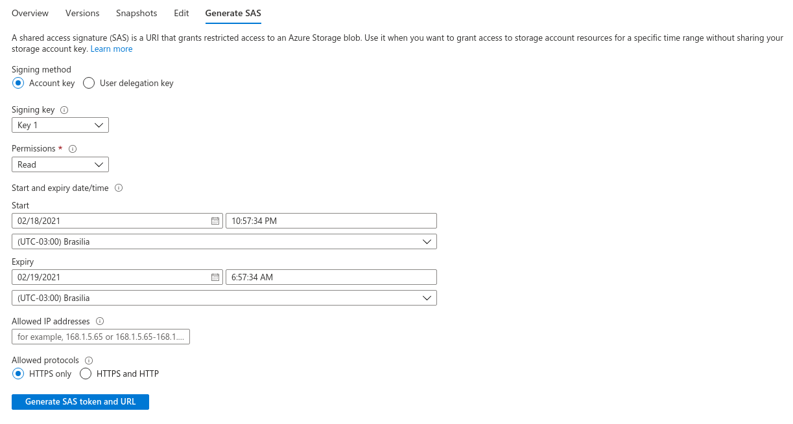
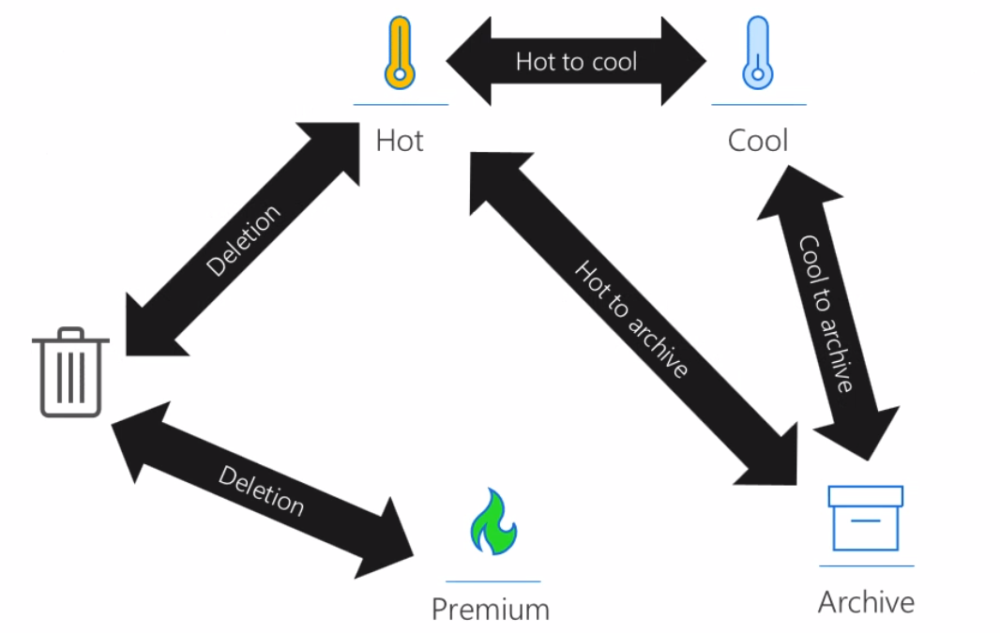

# Blob storage

## Access Level

File URL example <https://hvitoi.blob.core.windows.net/data/image.jpg>

- **Access level types**

  - `Private`: no anonymous access
  - `Blob`: anonymous read access for blobs only
  - `Container`: anonymous read access for containers and blobs

- **Access Keys**

  - Access keys are used to authenticate against a SA
  - There are `2 keys` for higher availability
  - In case one is compromised and has to be replaced

- **Shared access signature (SAS)**

  - A SAS is a URI that grants restricted access to a `blob` or to an entire `storage account`.
  - Grant access for a `specific time range` without sharing your storage account key

  

  - Generates a `Blob SAS URL` and a `Blob SAS Token` (to be used in the URL)

- **Access policy**
  - To change or revoke a SAS, an `access policy` can be created
  - The SAS must be created based on that policy
  - Then you can change/delete the policy (and the SAS) at any time

## Access tiers

- The access tier is set for the `entire SA` or `per file`
- Types

  - `Hot`: Frequent access ($0.02/GB/month)
  - `Cool`: Infrequent access ($0.01/GB/month)
  - `Archive`: Rare access ($0.001/GB/month)
    - Blob in archive mode is inaccessible until it is `rehydrated` back to hot or cool
    - The archive access tier can only be defined at individual blob level
    - The rehydratation can take from 1 to 15 hours

- **Lifecycle management**

  - Rule-based policy
  - Transition the data to the appropriate access tier or expire at the end of the data's lifecycle
  - E.g., if blobs were not modified in the last day, then move to cool tier



## Data protection

- **Snapshots**

  - A picture in time of the previous versions of the blob

- **Versioning**

  - `Enable versioning` under `Data protection`
  - Old versions can be promoted (make it current)
  - Recover deleted versions

- **Soft delete**

  - `Enable soft deletes` under `Data protection`
  - Protects backup data from accidental deletes
  - Recover blobs that were previously marked for deletetion
  - Keep deleted blobs for n days (parametrized)
  - Enforce the retention period with `purge protection`

- **Change feed**

  - `Enable blob change feed` under `Data protection`
  - Transactional logs of all changes that occur in the blob & blob metadata
  - The change events are recorded in `Avro` as an append blob

## Dotnet Connectivity

- Uses the NuGet package `Azure.Storage.Blobs`
  - `BlobServiceClient` class: storage account instance
  - `BlobContainerClient` class: container instance
  - `BlobClient` class: blob instance
  - `BlobItem` class: blob instance in a list
  - `BlobDownloadInfo` class

```xml
<Project Sdk="Microsoft.NET.Sdk">

  <PropertyGroup>
    <OutputType>Exe</OutputType>
    <TargetFramework>net5.0</TargetFramework>
  </PropertyGroup>

  <ItemGroup>
    <PackageReference Include="Azure.Storage.Blobs" Version="12.8.3" />
  </ItemGroup>

</Project>
```

### CRUD operations

```cs
using System;
using Azure.Storage.Blobs;
using Azure.Storage.Blobs.Models;

namespace fire
{
  class Program
  {
    private static string connectionString = "DefaultEndpointsProtocol=https;AccountName=hvitoi;AccountKey={accountkey};EndpointSuffix=core.windows.net";
    private static string containerName = "data";
    private static string blobName = "image.jpg";
    private static string blobLocation = "./image.jpg";
    static void Main(string[] args)
    {
      // Initialize client
      BlobServiceClient blobServiceClient = new BlobServiceClient(connectionString);

      // Create container
      blobServiceClient.CreateBlobContainer(containerName);
      Console.WriteLine("Container created!");
      Console.WriteLine("-----");

      // List blobs in a container
      BlobContainerClient containerClient = blobServiceClient.GetBlobContainerClient(containerName); // container instance
      Console.WriteLine("List of blobs in the container:");
      foreach(BlobItem item in containerClient.GetBlobs())
      {
          Console.WriteLine(item.Name);
      }
      Console.WriteLine("-----");


      // Upload blob to a container
      BlobClient blobClient = containerClient.GetBlobClient(blobName); // blob (file) instance
      blobClient.Upload(blobLocation);
      //blobClient.UploadAsync(blobLocation);
      Console.WriteLine("New blob has been uploaded!");
      Console.WriteLine("-----");

      // Download blob from a container
      BlobClient blobClient_todownload = containerClient.GetBlobClient(blobName);
      blobClient_todownload.DownloadTo("./downloaded_blob.jpg");
      Console.WriteLine("Blob has been downloaded!");
      Console.WriteLine("-----");

      // Pause execution
      Console.WriteLine("Press any key to exit.");
      Console.ReadKey();
    }
  }
}
```

### Properties and metadata

```cs
BlobProperties _properties = _blob_client.GetProperties();
_properties.AccessTier; // access tier
_properties.ContentLength; // size

// dictionary of all properties
IDictionary<string, string> _metadata = _properties.Metadata;
foreach(var item in _metadata)
{
  Console.WriteLine(item.Key);
  Console.WriteLine(item.Value);
}

// set a new key-value metadata
_metadata.Add("new-key", "new-value");
_blob_client.SetMetadata(_metadata);
```

### Leases

- When multiple applications change the same blob file
- A `lease` is like an `exclusive lock`
  - When an application is processing that file, it `acquires a lease` and the object is lock (no other application can modify it)
  - When the application finishes the changes, it `breaks the lease`

```cs
// Get blob
BlobServiceClient _service_client = new BlobServiceClient(_connection_string);
BlobContainerClient _container_client = _service_client.GetBlobContainerClient(_container_name);
BlobClient _blob_client = _container_client.GetBlobClient(_blob_name);

// Download the blob to the memory
MemoryStream _memory = new MemoryStream();
_blob_client.DownloadTo(_memory);
_memory.Position = 0; // beginning of the memory stream

// Read the blob in memory
StreamReader _reader = new StreamReader(_memory);
Console.WriteLine(_reader.ReadToEnd());

// Acquire lease
BlobLeaseClient _blob_lease_client = _blob_client.GetBlobLeaseClient();
BlobLease _lease = _blob_lease_client.Acquire(TimeSpan.FromSeconds(30)); // null for infinite time
Console.WriteLine($"The lease is {_lease.LeaseId}");

// Write to the blob in memory
StreamWriter _writer = new StreamWriter(_memory);
_writer.Write("This is a change");
_writer.Flush(); // apply changes

// Set the blob upload configuration with the lease
BlobUploadOptions _blobUploadOptions = new BlobUploadOptions()
{
  Conditions = new BlobRequestConditions()
  {
    LeaseId = _lease.LeaseId // The lead ID has to be provided upon upload because it's locked
  }
};

// Upload the blob (modified) to SA
_memory.Position = 0;
_blob_client.Upload(_memory, _blobUploadOptions); // provide the lease id
Console.WriteLine("Change made");

// Break the lease
_blob_lease_client.Release();
```
