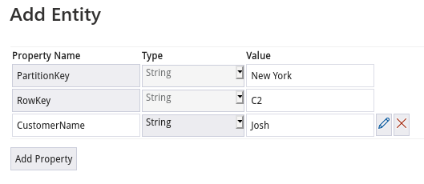

# Table storage

- Stores non-relational structured data
- `NoSQL` data
- Each `record` is an `entity` and it's made up of a `key-value` pair

- Default keys
  - `PartitionKey`: partition into which that entity will be inserted
  - `RowKey`: unique id for that entity



## Dotnet Connectivity

- Uses the NuGet package `Microsoft.Azure.Cosmos.Table`

```xml
<Project Sdk="Microsoft.NET.Sdk">

  <PropertyGroup>
    <OutputType>Exe</OutputType>
    <TargetFramework>net5.0</TargetFramework>
  </PropertyGroup>

  <ItemGroup>
    <PackageReference Include="Microsoft.Azure.Cosmos.Table" Version="1.0.8" />
  </ItemGroup>

</Project>
```

### CRUD operations

```cs
using Microsoft.Azure.Cosmos.Table;
using System;

namespace AzureTable
{
  class Program
  {
    private static string connection_string = "DefaultEndpointsProtocol=https;AccountName=hvitoi;AccountKey={account-key};EndpointSuffix=core.windows.net";
    private static string table_name = "Customer";

    static void Main(string[] args)
    {
      // Get Storage Account
      CloudStorageAccount _account = CloudStorageAccount.Parse(connection_string);

      // Get Table Storage
      CloudTableClient _client = _account.CreateCloudTableClient();

      // Get Table Reference
      CloudTable _table = _client.GetTableReference(table_name);
      _table.CreateIfNotExists();

      // Get entity (by partition key and row key)
      TableOperation _operation = TableOperation.Retrieve<Customer>(partition_key, row_key);
      TableResult _result = _table.Execute(_operation);
      Customer _customer = _result.Result as Customer;
      Console.WriteLine($"The customer name is {_customer.customername}");
      Console.WriteLine($"The customer city is {_customer.PartitionKey}");
      Console.WriteLine($"The customer id is {_customer.RowKey}");

      // Insert entity
      Customer _customer = new Customer("John", "Chicago", "C1");
      TableOperation _operation = TableOperation.Insert(_customer);
      TableResult _result = _table.Execute(_operation);
      Console.WriteLine("Entity added!");

      // Insert multiple entities
      List<Customer> _customers = new List<Customer>()
      {
        new Customer("Alice", "Chicago", "C2"),
        new Customer("Mathew", "Chicago", "C3"),
        new Customer("Maria", "Chicago", "C4"),
      };
      TableBatchOperation _operation = new TableBatchOperation();
      foreach (Customer _customer in _customers)
      {
        _operation.Insert(_customer);
      }
      TableBatchResult _result = _table.ExecuteBatch(_operation);
      Console.WriteLine("Entities added!");

      // Update entity
      Customer _customer = new Customer("Hayley", partition_key, row_key);
      TableOperation _operation = TableOperation.InsertOrMerge(_customer);
      TableResult _result = _table.Execute(_operation);
      Console.WriteLine("Entity updated!");

      // Delete entity
      TableOperation _operation = TableOperation.Retrieve<Customer>(partition_key, row_key); // first get the entity
      TableResult _result = _table.Execute(_operation);
      Customer _customer = _result.Result as Customer;
      TableOperation _delete_operation = TableOperation.Delete(_customer); // delete the retrieved user
      TableResult _delete_result = _table.Execute(_delete_operation);
      Console.WriteLine("Entity removed!");

      // Pause execution
      Console.ReadKey();
    }
  }
}
```

- Customer entity

```cs
namespace AzureTable
{
  class Customer: TableEntity
  {
    public string customername { get; set; }

    public Customer()
    {

    }

    public Customer(string _customername, string _city, string _customerid)
    {
        PartitionKey = _city;
        RowKey = _customerid;
        customername = _customername;
    }
  }
}

```
