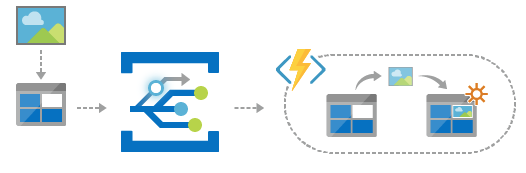

# Azure Event Grid System Topic

- `Listen to events` emitted by Azure resources or your own application
- Example: event emitted by a storage account is sent to `Event Grid System Topic` and from there it's forwarded to the handler

## Events



- Resources have a `Events` tab. There you can configure support for sending events to `Event Grid System Topic`

- **Subscription**
  - Listen for events emitted by the resource (event source)
- **Topic**
  - The `Event Grid System Topic` to where to send the events.
  - In the Event Grid System Topic itself there will be an identifier for the topics of each resource
  - The types of events to be pushed to the topic can be `filtered`. E.g., blob created, blob deleted
- **Handler**
  - To where to send the events that arrived in the topic
  - Event Grid actively sends the event to the `handler endpoint` (the handler itself does not perform pooling)
  - E.g, Azure Function, Webhook, Storage Queue

## Schema

- The data part of the event has its own properties depending on the event schema

- **Event Grid Schema**

  ```json
  [
    {
      "topic": "string",
      "subject": "string",
      "id": "string",
      "eventType": "string",
      "evenTime": "string",
      "data": {
        object-unique-to-each-publisher
      },
      "dataVersion": "string",
      "metadataVersion": "string",
    }
  ]
  ```

- **Cloud Event Schema v1.0**
- **Custom Input Schema**

## Filters

- **Event Types**

  - Filter based on the type of events
  - BlobCreated, BlobDeleted, etc

- **Subject Filters**

  - Match with the subject of the event
  - Example of subject: /blobServices/default/containers/data/blobs/img.jpg
  - Filter: Subject ends with .jpg
  - Filter: Subject beings with /blobServices/default/containers/data

- **Advanced Filters**

  - Based on `other properties` of the event (id, topic, subject, eventtype, dataversion, etc)
  - E.g., subject -> string is in -> /subscriptions/...

## Additional Features

- `Retry Policy`: how many times event deliver to the handler will be retried. Also specify a TTL of the event
- `Dead Lettering`: store events that could not be delivered in a storage account
- `Subscription Expiration time`: delete the subscription automatically after some time
- `Batching`: delays the send of events to increase throughput

## Configuring Webhook endpoint handler

- Normally you use a Event Grid Trigger to configure the function app
- But you can also use a normal HTTP Trigger webhook

- First Event Grid will perform a `handshake` with your application.

  - It will send a `validation code` and a `validation url` onto your application
  - Then your application should send the code back to the url
  - This helps event grid to know that the application is you
  - This handshake is done automatically to the other forms of endpoint (storage queue, function apps, etc). You must do it manually for your own api

- Requires Nuget package <Microsoft.Azure.EventGrid>

```csharp
public static class GetEvents
{
  [FunctionName("GetEvent")] // /api/GetEvent
  public static async Task<IActionResult> Run(
    [HttpTrigger(AuthorizationLevel.Function, "get", "post", Route = null)] HttpRequest req,
    ILogger log
  )
  {
    // Get request body
    string body = new StreamReader(req.Body).ReadToEnd();
    log.LogInformation($"Received request body {body}");

    // Subscribe to Event Grid
    EventGridSubscriber subscriber = new EventGridSubscriber();
    EventGridEvent[] events = subscriber.DeserializeEventGridEvents(body); // Deserialize all events
    foreach(EventGridEvent event in events)
    {
      // If the event is actually an validation data
      if (event.Data is SubscriptionValidationEventData)
      {
        SubscriptionValidationEventData validationData = (SubscriptionValidationEventData) event.Data;
        log.LogInformation($"Validation code {validationData.ValidationCode}");
        log.LogInformation($"Validation URL {validationData.ValidationUrl}");
        SubscriptionValidationResponse response = new SubscriptionValidationResponse()
        {
          ValidationResponse = validationData.ValidationCode
        };
        return new OkObjectResult(response); // Respond with the code itself
      }
    }
    return new OkObjectResult(string.Empty); // if no validation data is found, return empty
  }
}
```

## Custom Event Grid Topics

- When creating an Subscription to resources, the `Topic Type` is set automatically according to the type of the resource (E.g., Storage Account) and saved as a `Event Grid System Topic`
- But you can also set up your own `Custom Topic Type`, for that, it will be saved as a `Event Grid Topic`
- This way, you can set your own `Custom Source`! (not from azure resources)
- Your custom topic will have a custom endpoint <https://mytopic.eastus2-1.eventgrid.azure.net/api/events>

  - The custom topic will have also a `key` that will be used by the `events source` in order to publish events in the event grid

- Create a events source. Requires `Azure.Messaging.EventGrid`

```csharp
class Program
{
  private static Uri topic_endpoint;
  private static AzureKeyCredential topic_accesskey;

  static void Main(string[] args)
  {
    topicEndpoint = new Uri("https://mytopic.eastus2-1.eventgrid.azure.net/api/events");
    topicAccessKey = new AzureKeyCredential("access-key");

    EventGridPublisherClient client = new EventGridPublisherClient(topicEndpoint, topicAccessKey);

    Order order = new Order()
    {
      OrderID = "O1",
      UnitPrice=9.99m,
      Quantity=100
    };

    List<EventGridEvent> eventsList = new List<EventGridEvent>()
    {
      // Create the event object
      new EventGridEvent(
        "Placing new order",
        "app.neworder",
        "1.0",
        JsonSerializer.Serialize(order) // data
      )
    };

    client.SendEvents(eventsList);
    Console.WriteLine("Sending Event");
  }
}
```
