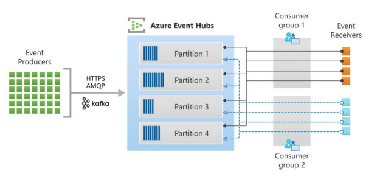

# Azure Event Hub

- Big data streaming platform
- Can receive and process millions of events per second
- Log data, telemetry data, etc
- Event Hub namespace: <hvitoi.servicebus.windows.net>
- Pricing Tiers: Basic (1 consumer group), Standard (up to 20 consumer groups)



## Components

- **Event producer**: entity that sends data to event hub using protocols such as `HTTPS`, `AMQP`, `Kafka`, etc

- **Partitions**: data split across partitions. Allow higher throughput for consuming. One partition can be read by one and only one consumer at time. The number of partitions `cannot be changed`

- **Consumer Groups**: a view of the entire event hub

- **Throughput**: controlls the throughput capacity of event hubs

- **Event Receiver**: entity that reads data

## Message retention

- Differently from `Service Bus Topics`, in Event Hubs the message is persisted in disk and not deleted after consumed
- In `Event Hub`, the consumer can read data in any point in time! (respecting the expiration timespan)
- There is no way to delete the message from event hub, you have to rely on the expiration time (message retention)!

- In Event hub you can consume messages `from the beginning` or `from a specific offset`

## Throughput

- The throughput is set per `Event Hub Namespace`
- You are billed based on the **throughput units**
- Example (1 unit)
  - `Ingress (Produce)`: up to 1 MB/s or 1000 events/s
  - `Egress (Consume)`: up to 2 MB/s or 2096 events/s

## Event Hub Instance

- A `event hub instance` in Azure is equivalent to a Topic in Kafka

- `Name`: name of the event topic
- `Partition Count`: number of partitions to split the data
- `Message Retention`: data retention in days
- `Capture`: persist the events onto an external source (E.g., storage account). Similar to Kafka Connect

## Dotnet SDK

- Nuget Package: <Azure.Messaging.EventHubs> (Produce and Consume)
- Nuget Package: <Azure.Messaging.Eventhubs.Processor> ()
- Connection string can be generated from the `Shared Access policies` in the Event Hub (Topic) or from the namespace (global)

```csharp
class Program
{
  private static string connectionString = "Endpoint=sb://hvitoi.servicebus.windows.net/;SharedAccessKeyName=Send;SharedAccessKey=h6Ofx9RetxnfS4f90/HgWARN6J7tb7SciJmpnPBmrpo=;EntityPath=apphub";
  private static string consumerGroup = "$Default";
    static async Task Main(string[] args)
  {
    // Event Hub Producer Client
    EventHubProducerClient producer = new EventHubProducerClient(connectionString);

    // Create orders
    List<Order> orders = new List<Order>()
    {
      new Order() {OrderID="O1",Quantity=10,UnitPrice=9.99m,DiscountCategory="Tier 1" },
      new Order() {OrderID="O2",Quantity=15,UnitPrice=10.99m,DiscountCategory="Tier 2" },
      new Order() {OrderID="O3",Quantity=20,UnitPrice=11.99m,DiscountCategory="Tier 3" },
      new Order() {OrderID="O4",Quantity=25,UnitPrice=12.99m,DiscountCategory="Tier 1" },
      new Order() {OrderID="O5",Quantity=30,UnitPrice=13.99m,DiscountCategory="Tier 2" }
    };

    // Prepare batch of orders to be produced
    EventDataBatch batch = producer.CreateBatchAsync().GetAwaiter().GetResult();
    foreach (Order order in orders)
      batch.TryAdd(new EventData(Encoding.UTF8.GetBytes(order.ToString())));

    // Produce!
    producer.SendAsync(batch).GetAwaiter().GetResult();
    Console.WriteLine("Batch of events sent");

    // Event Hub Consumer Client
    EventHubConsumerClient consumer = new EventHubConsumerClient(consumerGroup, connectionString);

    // Consume!
    await foreach(PartitionEvent _event in consumer.ReadEventsAsync())
    {
      Console.WriteLine($"Partition ID {_event.Partition.PartitionId}");
      Console.WriteLine($"Data Offset {_event.Data.Offset}"); // offset in terms of bytes
      Console.WriteLine($"Sequence Number {_event.Data.SequenceNumber}"); // offset in terms of decimal numbers
      Console.WriteLine($"Partition Key {_event.Data.PartitionKey}");
      Console.WriteLine(Encoding.UTF8.GetString(_event.Data.EventBody));
    }
  }
}
```

## Multiple Partitions

- It's a good pratice to do not let one consumer to read from more than one partition
- Instead, you can run a consumer for each partition in your event hub
- In `Event Hub` one partition can be read by up to `5 concurrent consumers` in the same consumer group (differently from Kafka where one partition can be read by only one consumer in the same consumer group)
  - When reading concurrently from a partition, you must add a logic to your application to do not process a message multiple times!

```csharp
class Program
{
  private static string connectionString = "Endpoint=sb://hvitoi.servicebus.windows.net/;SharedAccessKeyName=Listen;SharedAccessKey=access-key;EntityPath=newhub";
  private static string consumerGroup="$Default";

  static async Task Main(string[] args)
  {
    // Producer client
    EventHubConsumerClient consumer = new EventHubConsumerClient(consumerGroup, connectionString);

    // Get the first partition
    string partitionId = (await consumer.GetPartitionIdsAsync()).First();

    // Force reading from the first partition
    PartitionEvent[] events = consumer.ReadEventsFromPartitionAsync(partitionId, EventPosition.Earliest) // read from beginning

    await foreach(PartitionEvent _event in events)
    {
        Console.WriteLine($"Partition ID {_event.Partition.PartitionId}");
        Console.WriteLine($"Data Offset {_event.Data.Offset}");
        Console.WriteLine($"Sequence Number {_event.Data.SequenceNumber}");
        Console.WriteLine($"Partition Key {_event.Data.PartitionKey}");
        Console.WriteLine(Encoding.UTF8.GetString(_event.Data.EventBody));
    }
  }
}
```

## Event Processor

- `Event Processor` is an implementation to save the last processed message in each partition in an external source
- To `read from the last unread message` (instead of from beginning), you must save the last processed message in an external database
- After a message is read, the processor updates the `checkpoint` information

- Nuget package: <Azure.Messaging.Eventhubs.Processor>

```csharp
class Program
{
  private static string connectionString = "Endpoint=sb://appnamespace1000.servicebus.windows.net/;SharedAccessKeyName=Listen;SharedAccessKey=access-key;EntityPath=apphub";
  private static string consumerGroup = "$Default";
  private static string storageAccountConnectionString = "DefaultEndpointsProtocol=https;AccountName=appstore2000;AccountKey=account-key;EndpointSuffix=core.windows.net";
  private static string containerName = "eventhub";

  static async Task Main(string[] args)
  {
    // Storage Account Client
    BlobContainerClient containerClient = new BlobContainerClient(storageAccountConnectionString, containerName);

    // Event Processor Client
    EventProcessorClient processor = new EventProcessorClient(containerClient, consumerGroup, connectionString);

    // Start processing the message
    processor.ProcessErrorAsync += OurErrorHandler;
    processor.ProcessEventAsync += OurEventsHandler;
    await processor.StartProcessingAsync();
    await Task.Delay(TimeSpan.FromSeconds(30)); // 30 s timeout to simulate a message processing
  }

  static async Task OurEventsHandler(ProcessEventArgs eventArgs)
  {
    Console.WriteLine($"Sequence number {eventArgs.Data.SequenceNumber}");
    Console.WriteLine(Encoding.UTF8.GetString(eventArgs.Data.EventBody));
    await eventArgs.UpdateCheckpointAsync(eventArgs.CancellationToken);
  }

  static Task OurErrorHandler(ProcessErrorEventArgs eventArgs)
  {
    Console.WriteLine(eventArgs.Exception.Message);
    return Task.CompletedTask;
  }
}
```

## Capture

- Capture is used to save the events from the event hub into an external storage. It's similar to `Kafka Connect`
- Azure Event Hubs Capture enables you to `automatically deliver the streaming data` in Event Hubs to an Azure Blob storage or Azure Data Lake Store account
- Requires Event Hubs Standard pricing tier
- Under `Capture` tab in the event hub instance

- Configuration
  - `Time window`: period in minutes after which a dump of the messages should be performed into the database
  - `Size window`: message size in MB after which a dump of the messages should be performed into the database

## Stream from Azure Resources

- Send `diagnose data` from azure resource into the Azure Event Hub
- Diagnostic data is available for most of Azure resource under the `Diagnostic settings` tab
- This data can be sent to
  - Log Analytics Workspace
  - Storage Account
  - Event Hub

## Event Hubs vs. Event Grid vs. Service Bus

- **Event Hubs**

  - Used for devices telemetry or distributed data streaming
  - Message size: 256 KB (basic tier) and 1 MB (standard tier)

- **Event Grid**

  - Lightweight notification of a condition or a state change
  - Example: when a change occurs to a blob, do somethind in the app
  - Message size: 1 MB (maximum)

- **Service Bus**

  - Raw data data needs to be processed
  - Great for decoupling of application components
  - Examples: orders processing, financial transactions
  - Message size: 256 KB or 1 MB (premium)
