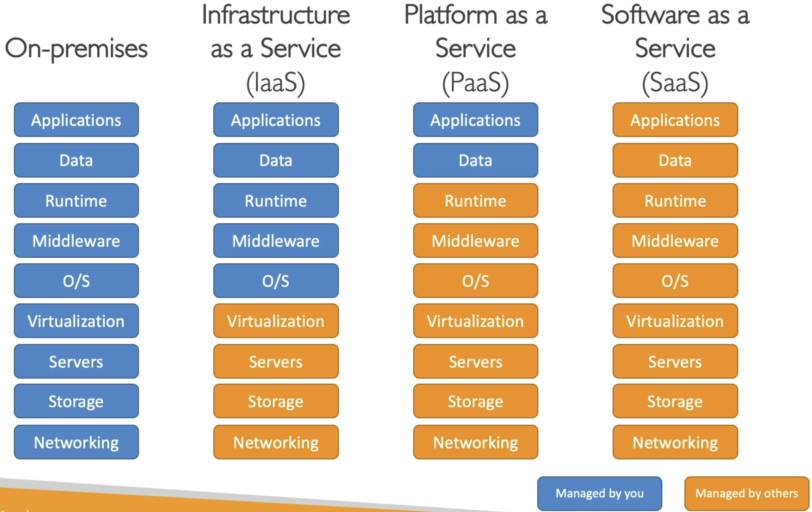

# Cloud

- Trade capital expenses (`CAPEX`) for operational expenses (`OPEX`)
- Reduce Total Cost of Ownership (`TCO`)

## Levels of abstraction

## IaaS (Infrastructure as a Service)

- Networking, computers, data storage
- Highest level of flexibility

## PaaS (Platform as a Service)

- Transparent infrastructure
- Focus o the deployment and management only

## SaaS (Software as a Service)

- Completely managed service
