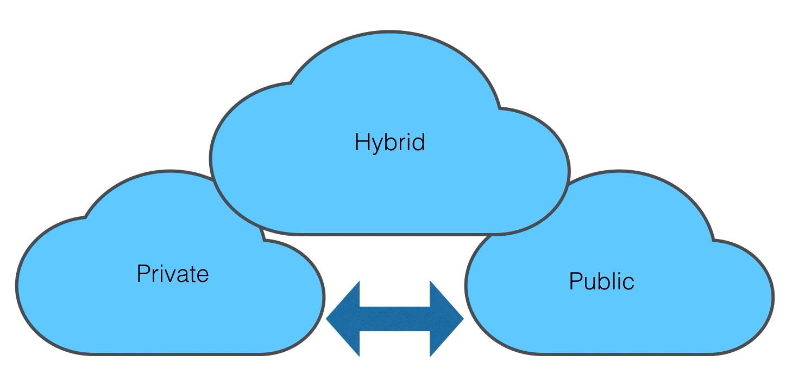
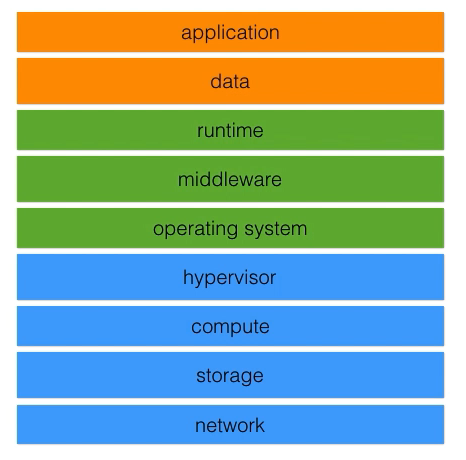

# Openstack

- Openstack is a free and open source platform to deliver private cloud computing
- Openstack is treated as IaaS





## Openstack installation

- Install a CentOS system from a Minimal ISO
- 6GB for RAM and 20GB disk space
- Network in Bridged mode
- Promiscuous mode to allow all
- Disable kdump and security policies
- Select manual IPv4 192.168.0.60 and Gateway 192.168.0.1 and DNS 8.8.8.8

```bash
# Check Internet connectivity
ping 192.168.0.60
ping 192.168.0.1
ping www.google.com

# Check the CentOS veersion
cat /etc/redhat-release

# Add locale settings
vi /etc/environment
#LANG=en_US.utf-8
#LC_ALL=en_US.utf-8

# Disable firewall
systemctl status firewalld
systemctl stop firewalld
systemctl disable firewalld
```

## Cloud computing

- Three delivery models: SaaS, PaaS, IaaS
- Characteristics:
  - On-demand self-service
  - Broad network access
  - Resource pooling
  - Rapid elasticity
  - Measured service
- Enabling technologies
  - Virtualization: Compute, Networking, Storage
  - Automation & Orchestration

## Traditional Computing Stack


- **IaaS**: Network, Storage, Compute, Hypervisor
- **PaaS**: + Operating System, Middleware, Runtime
- **SaaS**: + Data, Application

## Openstack services


- **Keystone**: Identity service
- **Glance**: Disk Image management
- **Neutron**: Virtual networks
- **Nova**: Computing
- **Cinder**: Persistent block storage
- **Swift**: Object storage
- **Horizon**: Dashboard


## Openstack Access

1. Horizon dashboard
2. Command Line Interface
3. API
