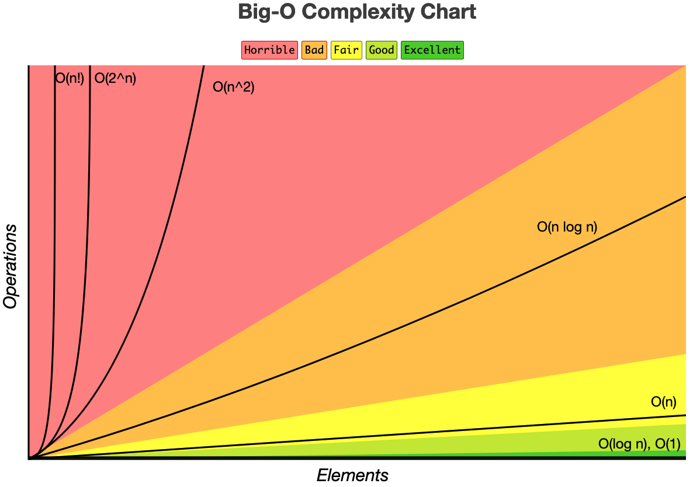

# Time Complexity

- Measures the `speed aspect` of an algorithm
- Describe the performance of an algorithm
- How much the `runtime` grows as the `input size` grows (n vs. t).
- It's estimated by counting the number of elementary steps performed by any algorithm to finish execution
- We use the worst-case time complexity of an algorithm because that is the maximum time taken for any input size



<https://www.bigocheatsheet.com/>

- The runtime complexity may differ depending on the input data, leading to
  - Best case: $\Omega$(n)
  - Average case: $\Theta(n)$
  - Worst case: $O(n)$

## Constant - $O(1)$

$$t = 1$$

- The number of items doesn't influence in the run time

```javascript
statement;
```

## Logarithmic - $O(log\ n)$

$$t = log(n)$$

- Based on a initial value, make the search to the left or to the right (like a phone book)
  - On each iteration, the working area (number of elements left to search) is halved
  - Divide and conquer strategy
- The base 2 is implicit on the runtime complexity $log_2\ n$
- Logarithmic
  - How many divisions by `<base>` on the `<anti-logarithm>` do I need to do until it reaches 1
- `Examples`:
  - Binary Search
    - Sorted arrays
    - Binary search tree

```javascript
// Numbers of times a number can be divided by 2
// Divides the working area in half on each iteration
while (low <= high) {
  mid = (low + high) / 2;
  if (target < list[mid]) high = mid - 1;
  else if (target > list[mid]) low = mid + 1;
  else break;
}
```

## Linear - $O(n)$

$$t = n$$

- Examples:
  - Iterating through a string (of a collection of data)

```javascript
for (i = 0; i < n; i++) {
  statement;
}
```

- $O(n+m)$: Iterating two different collections with separate for loops

## Log Linear (Quasilinear) - $O(n\ log\ n)$

$$t = n * log(n)$$

- The more items in the collections, the more time costly is the addition of each new item
- Examples:
  - Sorting algorithms: represents the minimum number of comparisons needed to know where to place each element

## Quadratic - $O(n^2)$

$$t = n ^ 2$$

- A loop inside of a loop
- Examples:
  - Steps algorithm
  - Handshake problem

```javascript
for (i = 0; i < n; i++) {
  for (j = 0; j < n; j++) {
    statement;
  }
}
```

- $O(n*m)$: Iterating two nested for loops over different collections

## Exponential - $O(2^n)$

$$t = 2 ^ n$$

- A single new element doubles the runtime
- Examples:
  - Recursive algorithms that solves a problem of size n

## Factorial - $O(n!)$

$$t = n!$$

- You are adding a loop for every element
