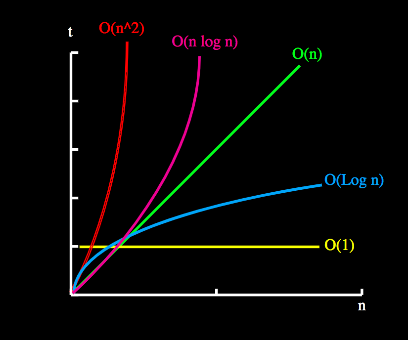

# Time Complexity

- Describe the performance of an algorithm
- How much the `runtime` grows as the `input size` grows (n vs. t).
- It's estimated by counting the number of elementary steps performed by any algorithm to finish execution
- We use the worst-case time complexity of an algorithm because that is the maximum time taken for any input size



## Constant time

$$t = 1$$

- The number of items doesn't influence in the run time

```javascript
statement;
```

## Logarithmic time

$$t = log(n)$$

- E.g.,:
  - Searching sorted arrays (binary search)
  - Numbers of times a number can be divided by 2 (divides the working area in half with each iteration). - Dividing the working area in half is logarithmic

```javascript
// Numbers of times a number can be divided by 2 (divides the working area in half with each iteration)
while (low <= high) {
  mid = (low + high) / 2;
  if (target < list[mid]) high = mid - 1;
  else if (target > list[mid]) low = mid + 1;
  else break;
}
```

## Linear time

$$t = n$$

- Runtime `one` to `one`
- If doubling the number of items, the run time will be doubled
- E.g., iterating through a string (of a collection of data)

```javascript
for (i = 0; i < N; i++) {
  statement;
}
```

- $O(n+m)$: Iterating two different collections with separate for loops

## Quasilinear time

$$t = n * log(n)$$

- Runtime increases more than input numbers
- E.g., sorting algorithms: represents the minimum number of comparisons needed to know where to place each element

## Quadratic time

$$t = n ^ 2$$

- A loop inside of a loop
- E.g., Steps algorithm, handshake problem

```javascript
for (i = 0; i < N; i++) {
  for (j = 0; j < N; j++) {
    statement;
  }
}
```

- $O(n*m)$: Iterating two nested for loops over different collections

## Exponential time

$$t = 2 ^ n$$

- A single new element doubles the runtime
