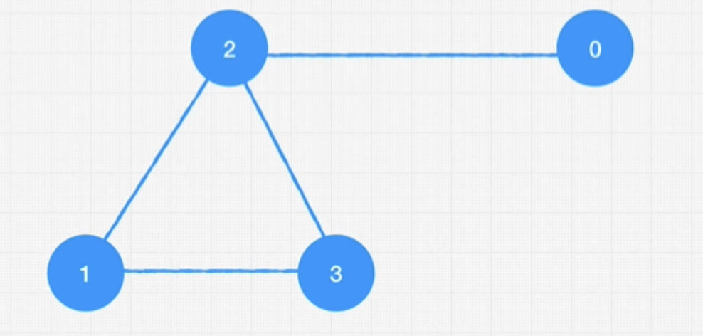

# Graph

- Great to represent networks. E.g., roads, relationships
- Trees and Linked Lists are also graphs

## Elements

- `Node (Vertex)`
- `Edge`: connects nodes

## Types

- **Direction**
  - `Directed`: edges have a direction. E.g., A follows B
  - `Undirected`: edges have no direction. E.g., A is friends with B
- **Weight**
  - `Weighted`: edges have a weight
  - `Unweighted`: edges have no weight
- **Cycle**
  - `Cyclic`: starting from a node it's possible to reach itself back again
  - `Acyclic`: no way for a node to reach itself again

- E.g., Directed Acyclic Graph (DAG)

## Representation



- **Edge List**: a list containing each edge connection (order is not important)

```python
graph = [
    [0, 2],
    [2, 3],
    [2, 1],
    [1, 3],
]
```

- **Adjacent List**: a list containing each node in order. Each node itself is a list containing all its connections (with other nodes)

```python
# as a list
graph = [
    ["C"],
    ["C", "D"],
    ["A", "B", "D"],
    ["B", "C"],
]

# as a map
graph = {
    "A": ["C"],
    "B": ["C", "D"],
    "C": ["A", "B", "D"],
    "D": ["B", "C"],
}

# as a map (weighted)
graph = {
    "A": {"C": 2},
    "B": {"C": 2, "D": 4},
    "C": {"A": 1, "B": 1, "D": 2},
    "D": {"B": 7, "C": 5},
}
```

- **Adjacent Matrix**: a list containing each node in order. Each node itself is a list containing if it's connected (0 or 1) with each of the other nodes. It can also contain weights (scalar) and directions (sign)

```python
# as a list
graph = [
    [0, 0, 1, 0],
    [0, 0, 1, 1],
    [1, 1, 0, 1],
    [0, 1, 1, 0],
]

# as a map
graph = {
    0: [0, 0, 1, 0],
    1: [0, 0, 1, 1],
    2: [1, 1, 0, 1],
    3: [0, 1, 1, 0],
}
```
