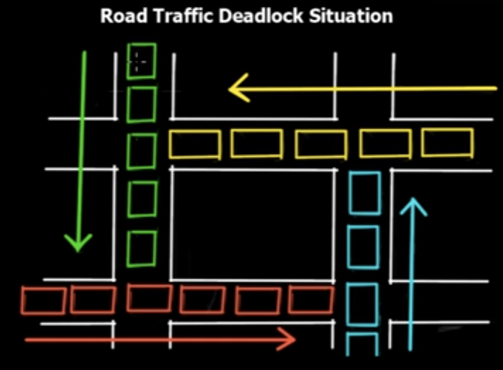

# Deadlocks

- When the `process A get stuck` because it requires a `resource that is busy` because it's being used by `process B` that requires process A to complete
- In this situation none of the process will ever continue: a deadlock
- Can happen either for `hardware resources` and for `software resources`



## Conditions for a deadlock to occur

- A deadlock can arise when the following conditions hold simultaneously

1. `Mutual exclusion`
    - A resource is non-sharable (only one process can use it at a time)
1. `Hold and wait`
    - A process will hold the resources already acquired while it is waiting to acquire another busy resource
1. `No preemption`
    - The OS (external scheduler) cannot interrupt the (stuck) process that holds a resource
    - The resource can only be released by the process itself
1. `Circular wait`
    - A set of processes are waiting for each other in circular form

## Code example

```txt
Thread A: Acquiring printer resource
Thread A: Using printer resource

Thread B: Acquiring camera resource
Thread B: Using camera resource

Thread A: Acquiring camera resource
Thread B: Acquiring printer resource
```

```python
# %%
import threading
import time

# resources
printer = threading.Lock()
camera = threading.Lock()


def use_printer_then_camera():
    thread = threading.current_thread().name

    print(f"{thread}: Acquiring printer resource")
    printer.acquire()
    print(f"{thread}: Using printer resource")

    time.sleep(1)

    print(f"{thread}: Acquiring camera resource")
    camera.acquire()
    print(f"{thread}: Using camera resource")

    print(f"{thread}: Releasing printer resource")
    printer.release()
    print(f"{thread}: Released printer resource")

    print(f"{thread}: Releasing camera resource")
    camera.release()
    print(f"{thread}: Released camera resource")


def use_camera_then_printer():
    thread = threading.current_thread().name

    print(f"{thread}: Acquiring camera resource")
    camera.acquire()
    print(f"{thread}: Using camera resource")

    time.sleep(2)

    print(f"{thread}: Acquiring printer resource")
    printer.acquire()
    print(f"{thread}: Using printer resource")

    print(f"{thread}: Releasing camera resource")
    camera.release()
    print(f"{thread}: Released camera resource")

    print(f"{thread}: Releasing printer resource")
    printer.release()
    print(f"{thread}: Released printer resource")


thread_a = threading.Thread(target=use_printer_then_camera, name="Thread A")
thread_b = threading.Thread(target=use_camera_then_printer, name="Thread B")


thread_a.start()
thread_b.start()

thread_a.join()
thread_b.join()
```

## Handling deadlocks

If a deadlock has happened, the following techniques can be applied

1. `Preemption`
    - Forces the interrupt of one or more processes can are causing the deadlock and thus release the resource
    - It may cause problems since the resource is non-preemptive

1. `Rollback`
    - Roll everything back into a previous checkpoint state

1. `Kill one or more processes`
    - Similar to preemption, but in this case the process is killed forever
