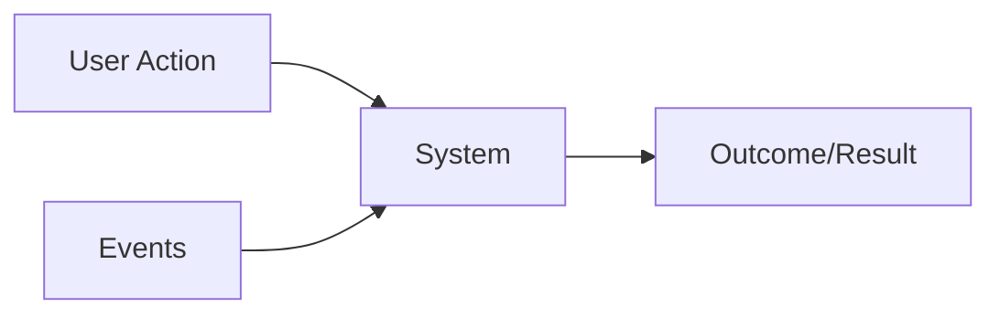

# Requirements

- `Requirements` is a formal description of how the system should behave
- It's important to raise the right requirements because changes in large systems are expensive (engineers, contracts, reputation, brand)
- Requirements are the `architectural drivers`

## Classification

### Feature Set (`Functional Requirements`)

- Requirements that define the target feature (`must do`)
- Results may be triggered by either user actions or events
- Functional requirements DO NOT influence on the architecture, since a feature can be implemented using any kind of architecture (just it may not be viable)

- **Examples**
  - User must have access to the e-commerce platform
  - User must be able to search an item
  - After a user uploads a file, they will get a unique link that they can share with other users. Any user with that link can download the file.

### Quality attributes (`Non-Functional Requirements`)

- Quality measures that brings value to the product (`must have`)
- Non-functional requirements DO influence on the architecture

- **Examples**
  - Minimum latency
  - Scalability
  - Flexibility
  - The link should become active no later than 1 second after the file is uploaded. Download speeds should be at least 50 Mbit/sec.

### System Constraints

- Limitations and boundaries
- System constraints requirements DO influence on the architecture

- **Examples**
  - Time constraints, strict deadlines
  - Financial constraints, limited budget
  - Staffing constraints, small number of available engineers
  - You have to support at least PDF and JPG file formats, as well as the following web browsers: Google Chrome, Mozilla Firefox, and Microsoft Edge.

### Extended Requirements

- Browsing data has to be saved for future analytics

## Gathering requirements

- The client (who demands the feature) usually do not know what they need (the requirement), but they know `what they want to solve`
  - Allow people to join drivers on a route, who are willing to take passengers for a fee
  - A system that allows sharing of large files between users.
- What problem is being solved here?

-`Make the right questions` to solve the problem!

### Use Cases

- It's a methodology for gathering requirements
- Explicits the situations/scenarios in which the system would be used
- A `user flow` is a detailed step-by-step graphical representation of each use case

1. Identify the `actors/users` of the system
1. Identify and describe all the `possible use cases`
1. Expand each use case in form of `user flows`
1. Detail the `actions` and `data` of each event

- Example: "allow people to join drivers on a route, who are willing to take passengers for a fee"
  - Actors
    - Driver and Rider
  - Use Cases
    - Rider first time registration
    - Driver registration
    - Rider login
    - Driver login
    - Successful match and ride
    - Unsuccessful ride
  - User flow ("Successful match and ride" expanded)
